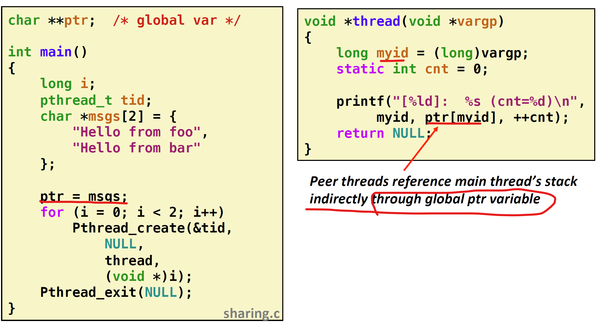
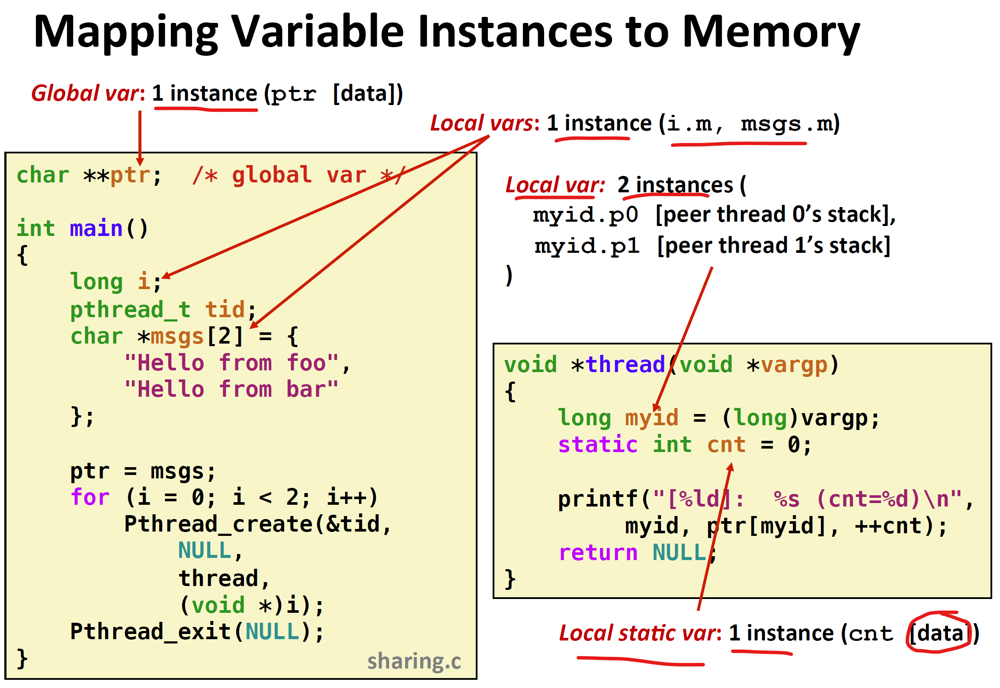
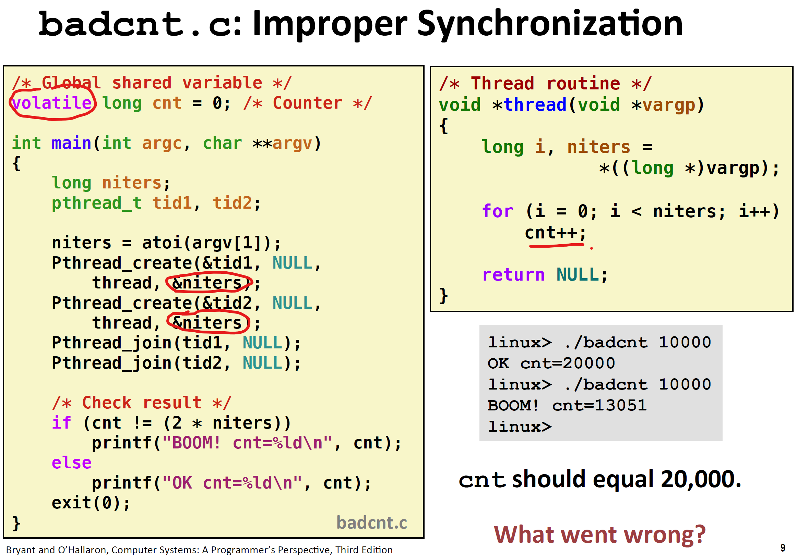
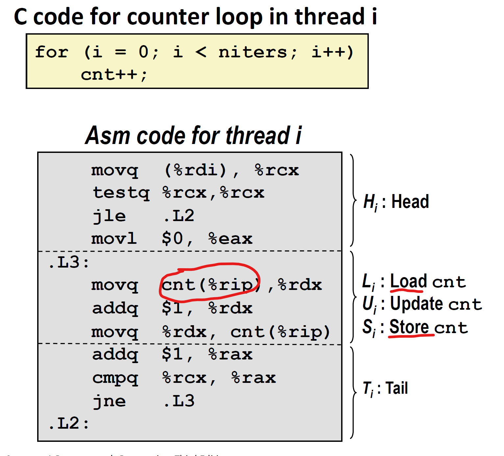
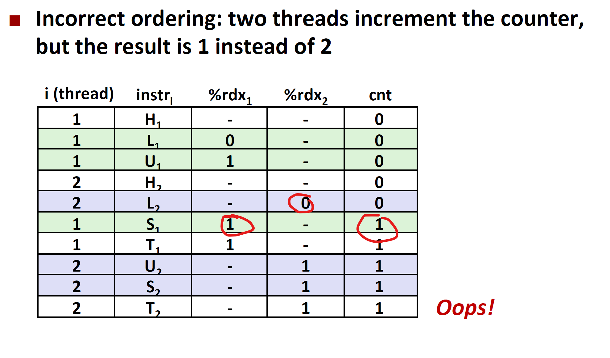
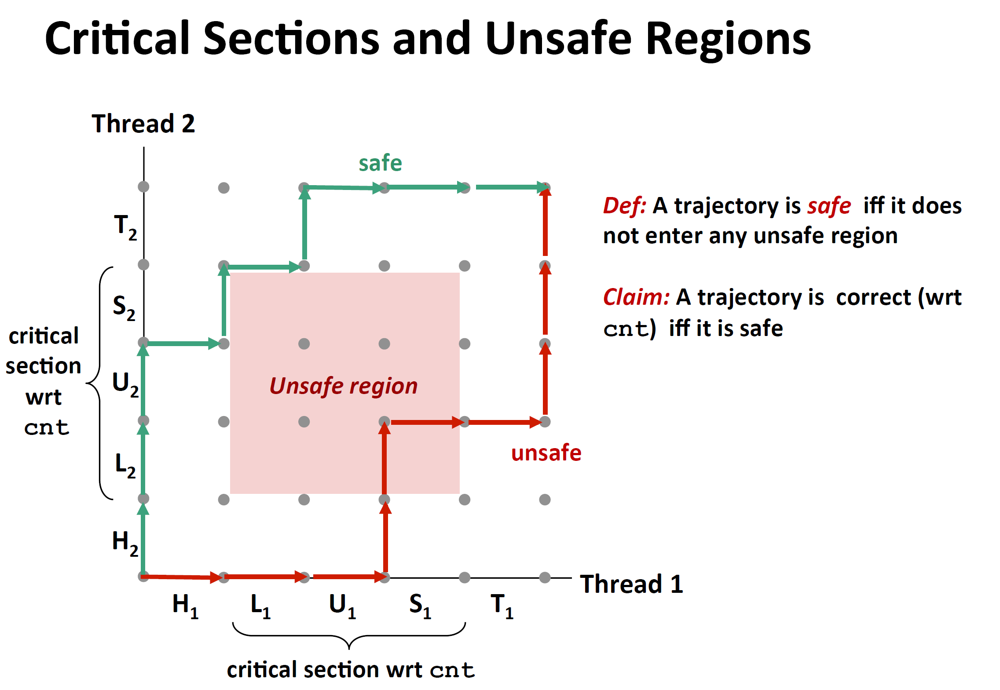
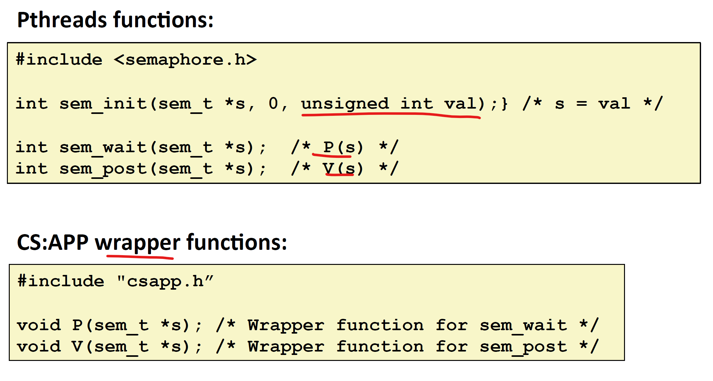
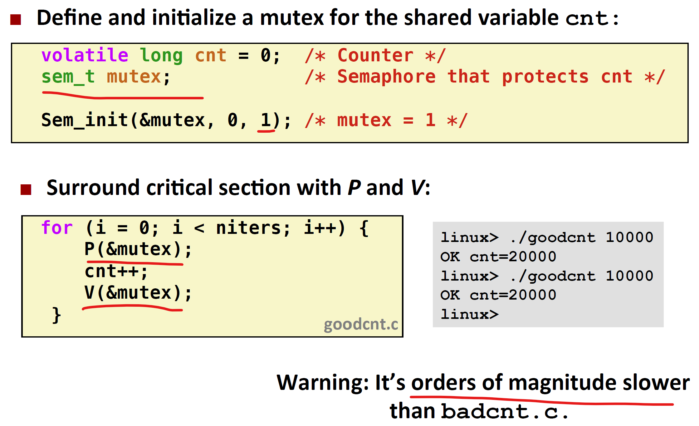

# 同步-基础

## 线程中的共享数据

如何判断数据被多线程共享呢？并不是全局变量就是共享的，线程栈内的变量是私有的。需要具体分析。

共享数据定义：如果多个线程都对某个变量X的实例有引用，则称这个变量是共享变量。

从以下三个方面来理解共享变量。

### 线程内存模型

理论上多线程在一个进程内运行，每个线程都有自己的stack,线程ID等，都共享code,heap等。

但实际操作中，除了寄存器中的数据是严格的私有和保护起来的，线程中栈内的数据是可以被其他线程读写的。

如下图所示：传入线程的全局指针ptr指向的是主线程中的栈内局部变量msgs，此时peer线程可以通过此全局指针去访问主线程栈内数据。

### 变量映射到内存

包括：全局变量，本地自动变量，本地静态变量。

全局变量：定义在函数体之外，运行时只含有一个实例，放在data区域，每个线程都可以引用。

本地自动变量：每一个线程都有自己的栈来存储所有的本地自动变量实例，就算是他们执行的是相同的线程实例。

本地静态变量：定义在函数体内，也只包含有一个实例，只能在函数体内使用，不同线程都使用这个函数时，进行数据共享（都可以读写这个唯一的实例）。

### 分析共享变量

分析下面代码中，哪些代码是线程私有，哪些代码是共享的。

可以发现：ptr和static变量只有一个实例，但是thread routine被两个线程使用，里面的局部自动变量每个线程栈都有一份实例。

共享变量：ptr,msgs,cnt。

## 共享数据引起的同步问题

### 错误代码分析

可以发现：nither虽然是主线程的局部变量，但是因为不会被修改，所以可以引用传递。

cnt是volatile的，也会是不回被存在寄存器中，每次操作都要在内存中取出和存回去。

可以发现，cnt++,需要进行三个步骤，但是由于线程交替，可能会出现以下错误：

其中：线程1在Load cnt并加一后，还没来得及存储，cnt被线程2load,此时cnt为0，最后线程1和线程2都是在0的基础上加1，cnt被写了两次1。

### 进度图

利用进度图，在n维笛卡尔坐标系中画出轨迹线，来表示多线程指令的执行顺序。如下图为双线程的进度图，图中有不安全区域，轨迹进入此区域，会发生错误。

L1,U1,S1等涉及对共享变量cnt的操作，两线程不能对其同时操作，构成不安全区域。

如果一条路径线没有经过不安全区域，则说明是安全的。

## 使用信号量解决同步问题

为了确保不产生不安全的路径线，可以使用信号量。

### 定义

信号量：非负整数，全局变量，由P(s),V(s)操作。

P(s)：如果s非零，则减少1并立即返回（system call）（原子性），立即进行当前线程的下一条指令。

如果s为零，则暂停当前线程，知道某一线程执行了V(s)，使得s变成非零，此时当前线程p(s)重启，将s减少1，返回被暂停的线程继续操作。

V(s)：s加1，如果有悬停的线程，则通过某种算法，选择一条悬停线程重启。

所有信号量总是大于等于1的。

### 接口

包括init：设置信号量，wait()：减少信号量，post()：增加信号量。

### 互斥

使用二元信号量（互斥锁）（mutex)，调用P(mutex)：锁定。V(mutex)：解锁。

引入信号锁，对cnt进行锁定，从而只能有一个线程操作cnt，不回被打断。

会比较慢，因为一直system call。

进度图变成如下：

可以发现由于信号量不能是-1，线程路径不会经过不安全区域，从而保证了路径的安全。