# 同步-进阶

## 使用信号量来协调线程

基本思想：使用信号量操作函数（P(),V()）来提醒其他线程某些状态的改变。

两个常见的例子：1，生产者-消费者模型。2，读/写模型

### 生产者-消费者问题

#### 基本思想

生产者：等待空槽（slot），把资源（Item）插入空槽，并提醒消费者。

消费者：等待资源，把资源提取出来（slot），产生空槽，并提醒生产者。

举例：多媒体系统/图形用户接口设计。

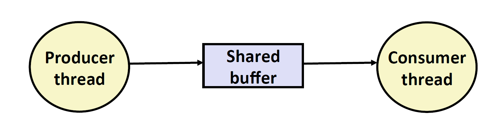

信号量：需要三个，分别是mutex，保证只能有一个线程在操作buffer。slots：表示当前的空槽位。items：表示当前有多少资源。

#### sbuf package

使用sbuf来实现此模型。具体实现如下所示：

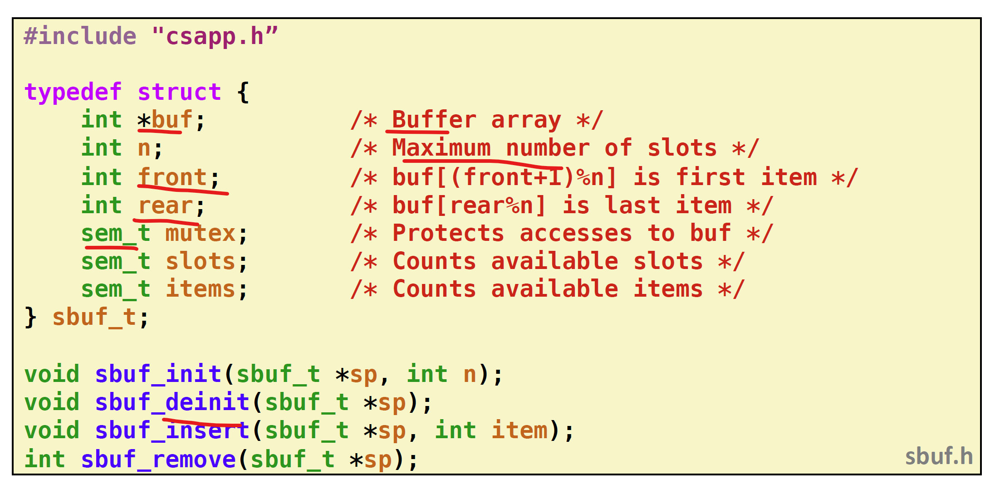

可以发现sbuf包定义了一个结构体以及4个函数。其中sbuf_t结构体中包含有buffer指针，buffer大小，两个首尾指针，以及三个信号量。

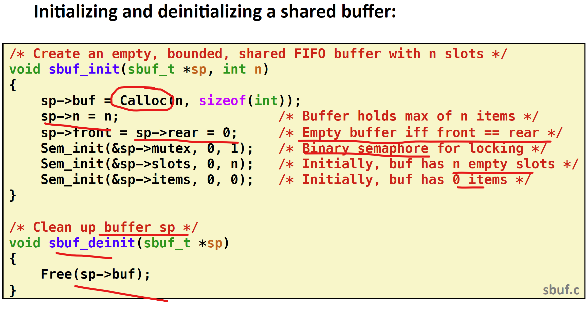

初始化过程：动态分配buffer（则可以共享），以及初始化信号量。

也可以使用deinit来释放动态分配的内存。

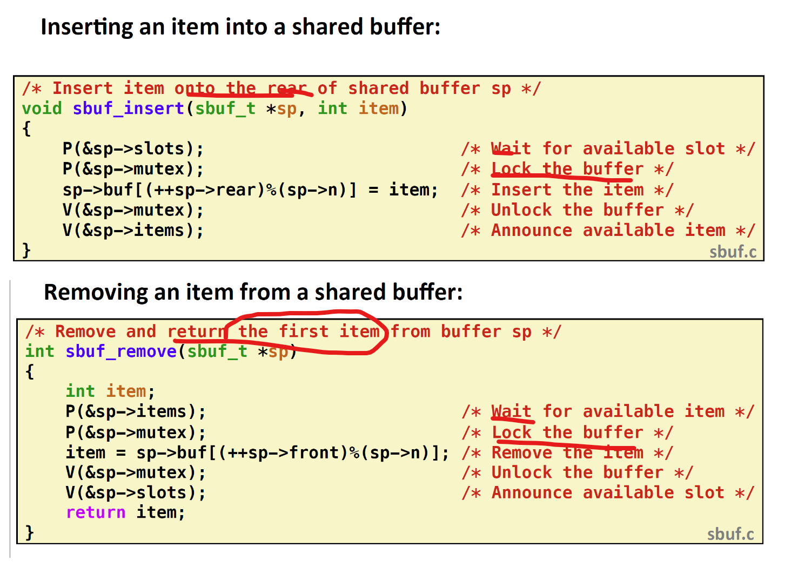

插入和取出资源的过程：需要先等待是否有空槽或者资源，然后插入资源或者取资源时，需要用互斥锁保护起来。

​	

### 读者/写者问题

#### 基本思想

读者线程：只能够读取某个对象。

写者线程：可以修改某个对象。

显然写者只能互斥访问对象，但是读者可以无限制的访问对象。

举例：航线预约系统，多线程web服务器的缓存

#### 解决方式

读者优先：当读者大于等于1时，我们会锁住写者，此时写者必须等所有读者（包括后来加入的读者）全部完成，才能开始写。

写者优先：只要写者开始写，则尽可能地执行写操作。

两者方式都会造成写者或者读者线程的饥饿。

读者优先程序举例：

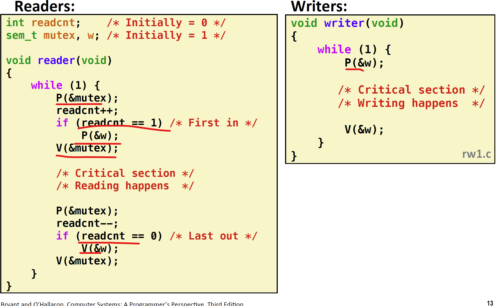

可以发现：

1. 需要用互斥锁保护readcnt。
2. 一旦读者数量大于1，就把写者锁住，直到读者数量为0，才释放写者锁。

### 预线程化并发服务器

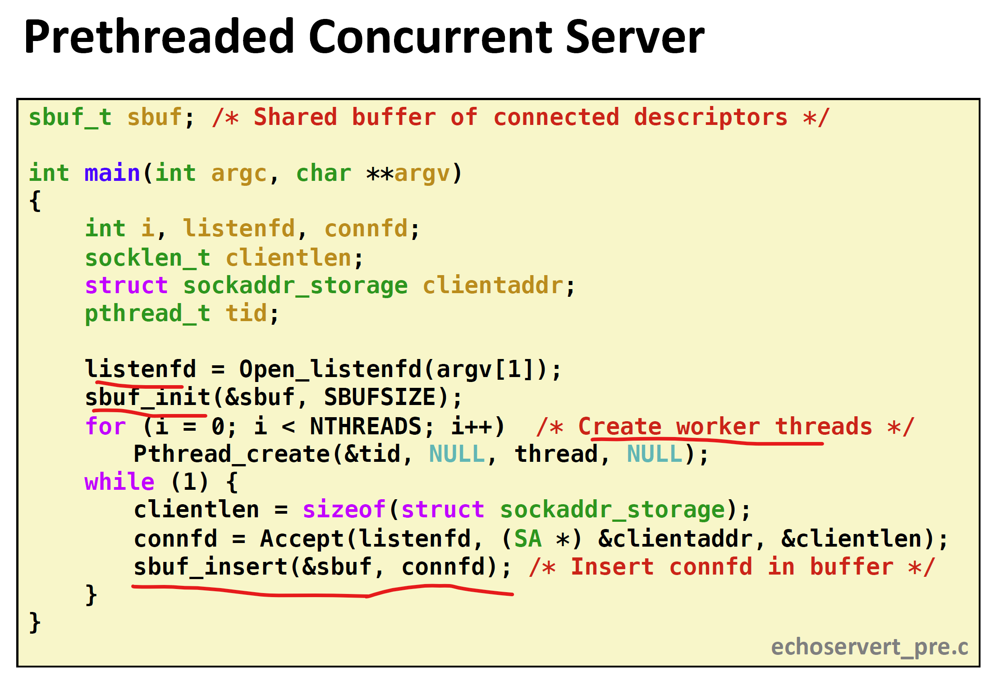

首先会创建N个预先的线程，然后等待连接，将每一个连接的connfd插入到buffer中。

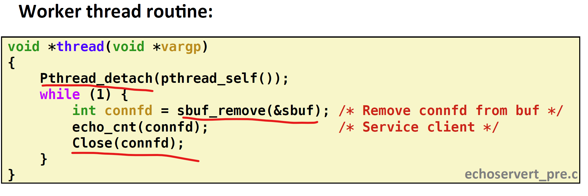

当Buffer中有item也就是connfd时，线程会执行echo，注意线程detached，并且永远不会终止。

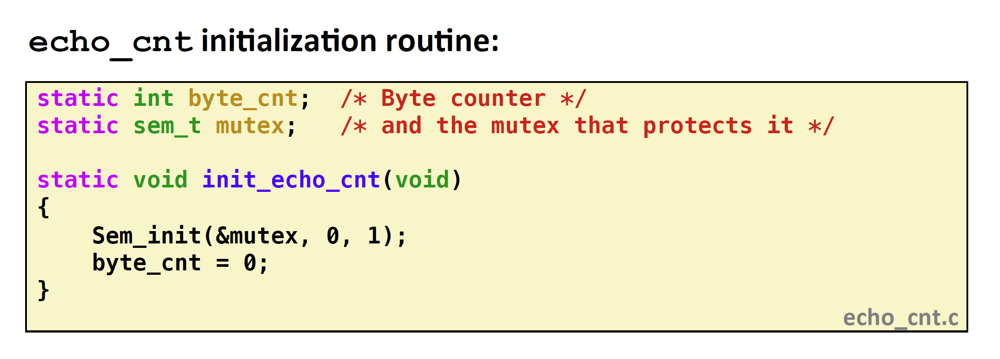

ehch_cnt程序统计用户发来的所有字节，存储在byte_cnt这个全局变量中，所以需要互斥锁，init_echo_cnt将echo初始化，这可以在主线程中进行，但是如下代码展示了在工作线程中初始化的方法。

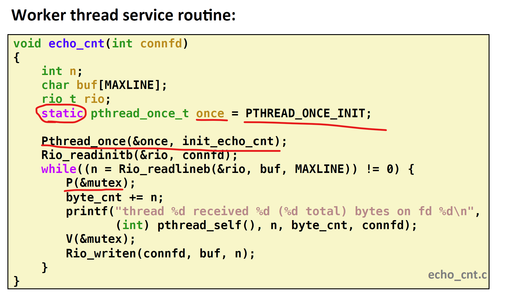

通过使用static变量，只会被第一个线程初始化一次（老师说不是这样。。），所以Pthread_once只会被调用一次，从而只会初始化一次echo_cnt。

## 线程安全函数

### 基本概念

定义：当一个函数被多个并发线程调用，并总能产生正确结果时，则这个函数为线程安全函数。

四种常见的线程不安全函数：

1. 没有保护共享变量的函数
2. 保持跨越多个调用的状态的函数
3. 返回指向静态变量指针的函数
4. 调用线程不安全函数的函数

### 线程不安全函数分析

* 没有保护共享数据的函数

如之前的badcnt.c程序，没有对共享数据cnt进行保护，从而发生了线程交替，造成错误结果。

* 保持跨越多个调用的状态的函数

典型例子是伪随机数生成函数，其当前调用的返回值，依赖于前一次调用的结果。

* 返回指向静态变量的指针的函数

很容易理解，因为静态变量的地址不变，此类函数的返回值是固定的，当多个线程调用此类函数，线程1的结果可以覆盖线程2的结果，可以选择重写（我们得有权限访问源代码），或者包装此函数，如下图，由于ctime返回的是静态函数地址，我们使用**加锁-复制**技术，对线程不安全函数加锁，然后将静态函数地址和我们的私有内存地址练习起来，这样就能保护此线程得到的地址不会被其它线程覆盖。

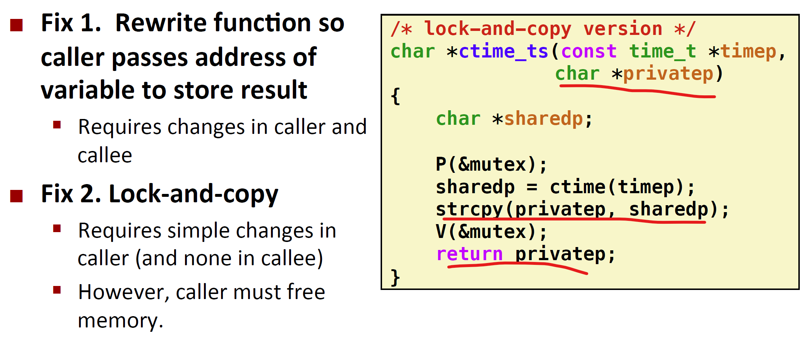

* 调用了线程不安全函数的函数

修改其调用函数，确保此函数的调用函数都是安全的。

### 可重入函数（reentrant function）

定义：当函数被多线程调用，没有任何共享数据时，则此函数是可重入的。

可重入函数和线程安全函数的关系如下所示：

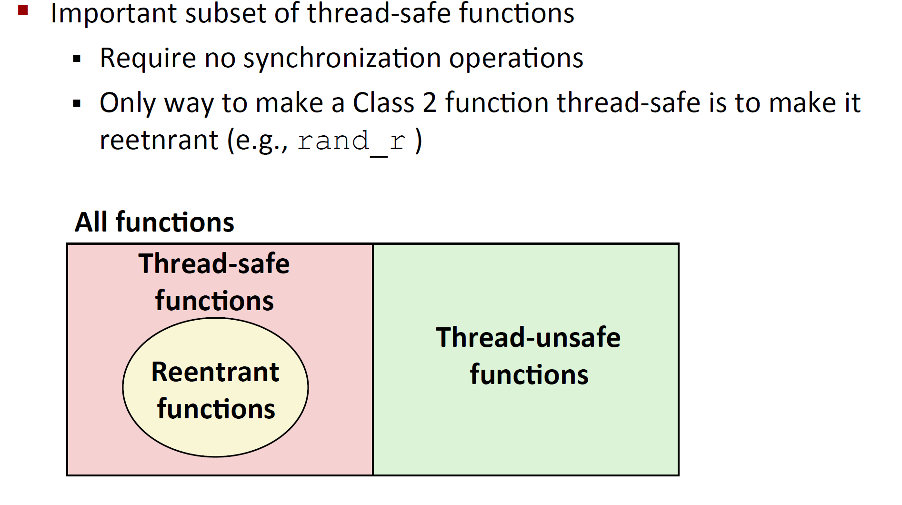

注意：所有C标准库中的函数，都是线程安全的！大部分unix的system call也是线程安全的。

### 竞争

当程序运行的正确性，取决于一个线程必须在另一线程到达y点前，到达x点，则称存在竞争。

如下图，由于所有线程都共享数据i，而数据i为了能提供正确的id给线程i，则必须不能在解引用前，被增加1.

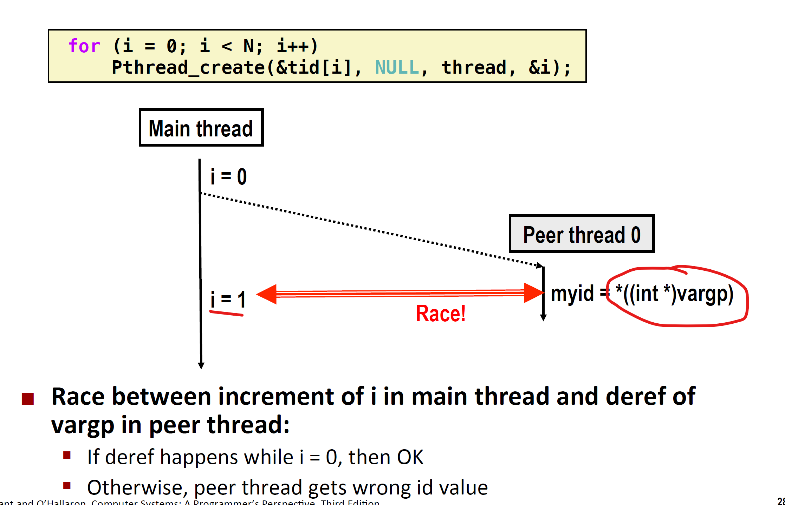

如何消除？给每一个i分配动态空间，这样传入的是ptr，且没有被共享。

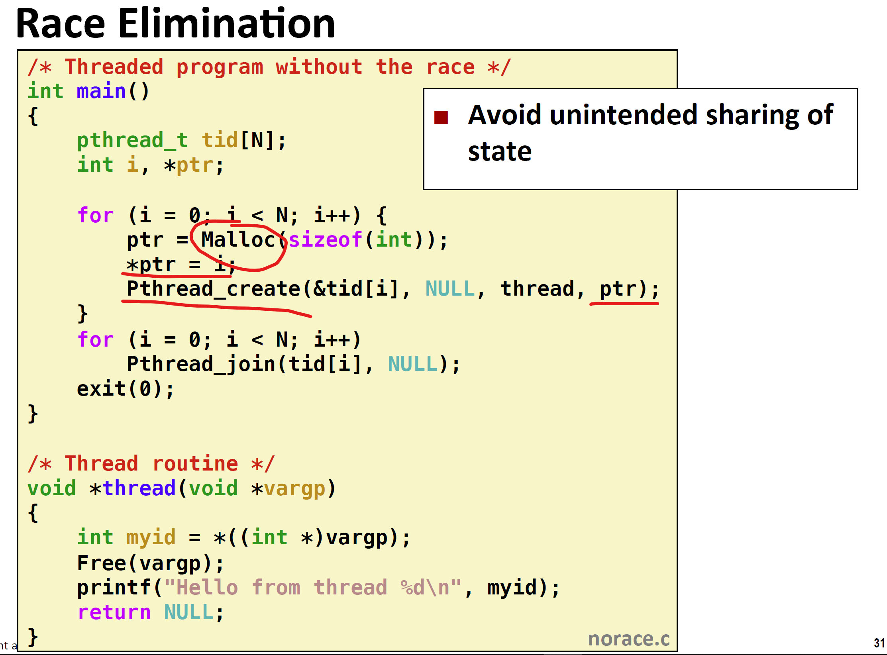

### 死锁

当一个进程（线程）等待一个永远不会发生的条件时，会出现死锁。

常见例子：

线程1和线程2都需要A，B资源才能继续进行，线程1先锁定了资源A，接着线程2锁定了资源B，此时两线程都无法继续进行，永远的等待下去。

下图代码表示两线程对两二元信号量的**锁定顺序**，导致了死锁。

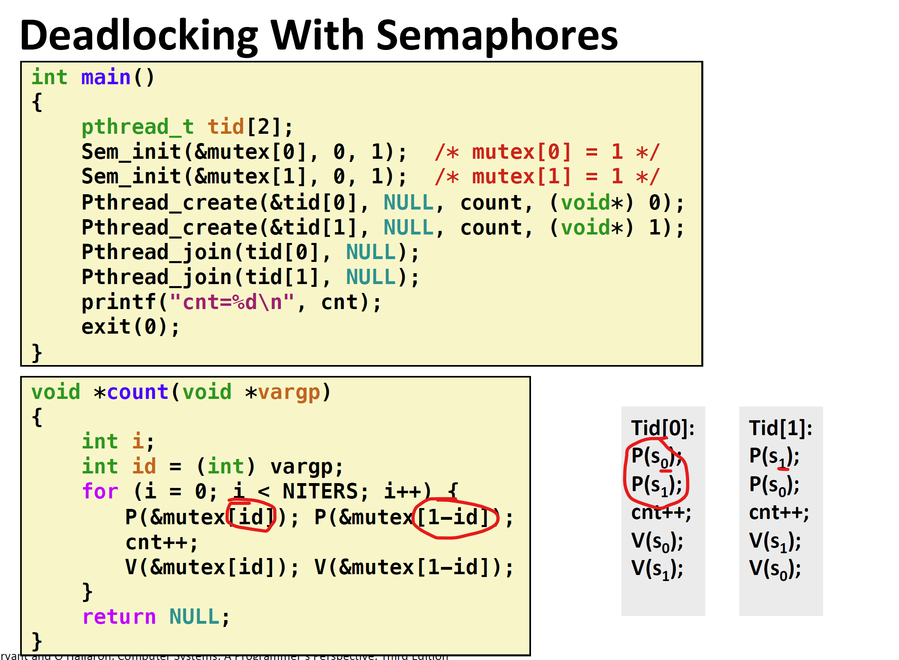

其线程图如下：

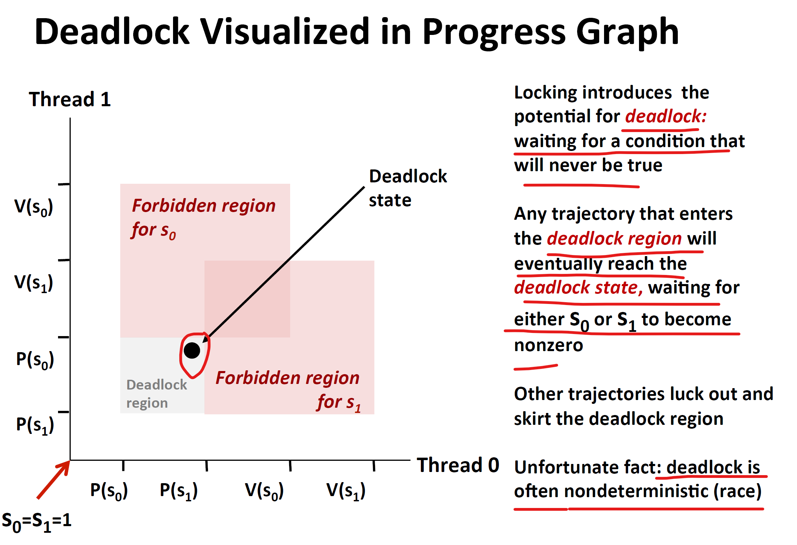

所有进入死锁区域的轨迹都最终会到死锁点。

简单修改锁定顺序，就可以防止上述代码的死锁现象。

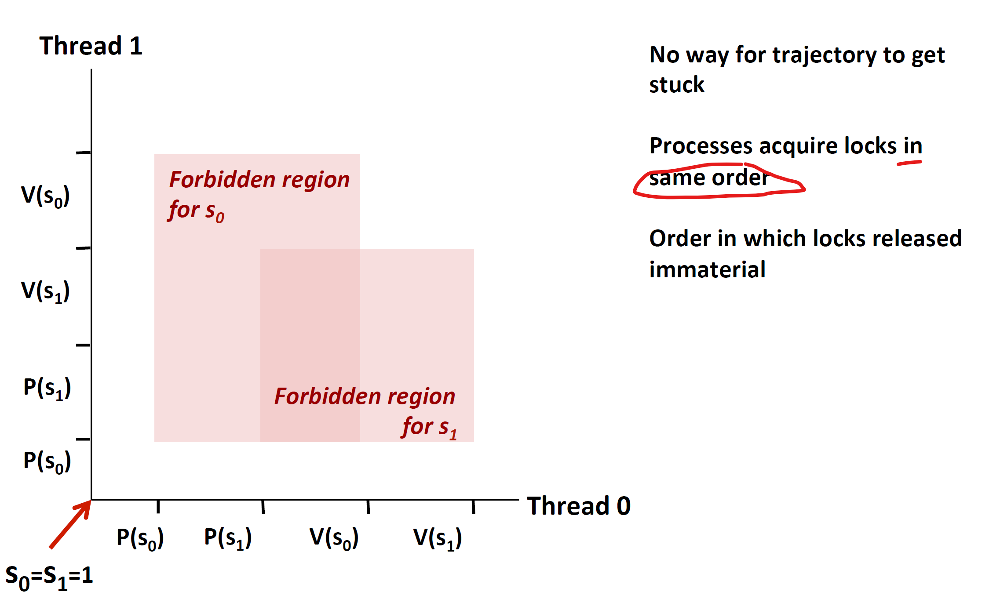