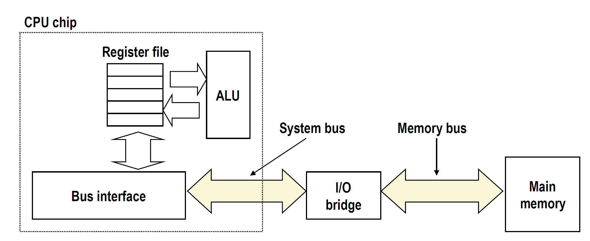
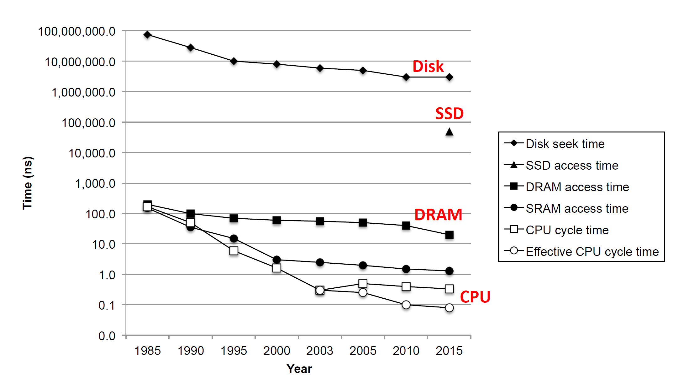
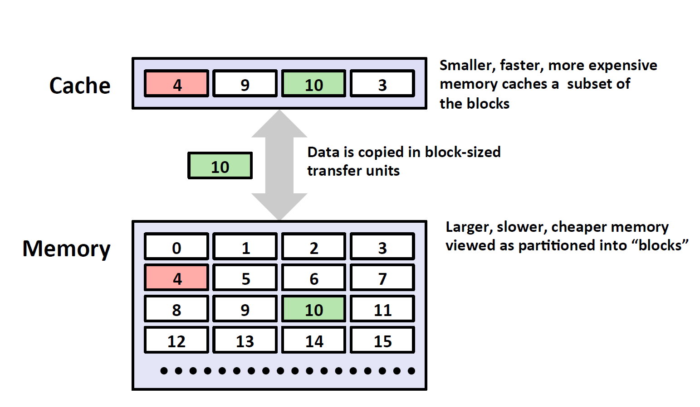
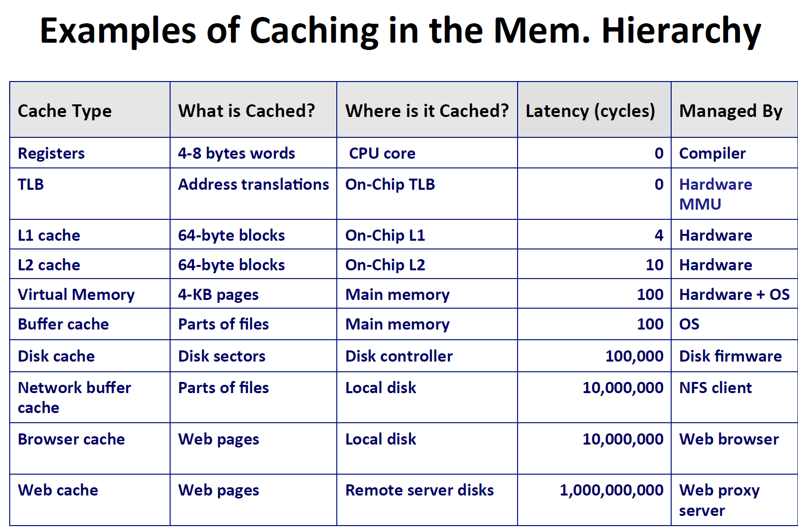

# 存储器层次结构

## 存储技术及趋势

### 随机存储器（RAM）

* 特点：封装成芯片，多个RAM芯片组成内存，以每个比特为一个单位。
* 种类：静态RAM（SRAM）和动态存储器（DRAM），其中SRAM的成本高，速度快，只要有电就可以永久保持值，不需刷新，常用作缓存。DRAM的成本低，速度慢，需要经常刷新（充电）.
* 属于易失性存储器，断电会丢失信息

### 只读存储器（ROM）

* 其实可以写（再编程）很多次，由于历史原因一直被叫做只读存储器
* EPROM：可擦写可编程ROM，可以重新编程1000次
* 闪存：也是非易失性存储器，基于EPROM
* SSD：固态硬盘，基于缓存的磁盘驱动器，比传统磁盘更快
* 固件：（firmware)，存储在ROM上的程序，如BIOS，驱动控制器等

### 总线结构（BUS STRCTURE）连接CPU和主存

1. 主存读取（read）

   包括：1，CPU将想要读取数据的地址传给主存。2，主存根据此地址获得所需数据，放在总线上传输3。，CPU从总线上读取数据，放入寄存器。

2. 主存存储（write）

   包括：1，CPU将想要存储的地址传到主存，主存知道了A处地址将要写入数据并等待数据传入。2，CPU将数据放在总线上。3，主存从总线上读取数据，写入到A。

由此可见，从主存中读取或写入数据都很耗时，大约是用寄存器操作数据的100多倍时间。

### 磁盘

* 几何结构：包括盘片（platters）（双面），磁道（tracks），柱面，扇区（sectors），间隙（gaps)等
* 容量：取决于记录密度（每个扇区能记录多少数据）和磁道密度。以前每个磁道的扇区数量相同，造成空间浪费，现在将磁盘分成不同的记录区域（recording zone），每个zone的扇区密度和磁道密度都不同。
* 如何在磁盘上读取数据：磁盘逆时针旋转，通过磁头（读/写头）在不同磁道的表面读写数据
* 磁盘读取速度：寻道时间+旋转等待时间+数据传输时间，由磁盘旋转速度（7200RPM）寻道速度（最慢）加上平均扇区读写时间
* 磁盘速度很慢，比SRAM慢40000倍，比DRAM慢2500倍。
* 对CPU来说，磁盘相当于连续的逻辑单元，将所需的逻辑单元号传给磁盘控制器（disk controller），可确定具体盘面，磁道，扇区在哪。
* 磁盘的格式容量（可用容量）比最大物理容量小，因为有些柱面预留给损害了的柱面备用。
* I/0 总线（bus）：之前的PCI总线是广播总线，在总线上传入一个值，所有设备都能获取到。现代总线称为PCI express总线，点对点传输，速度更快。
* CPU读取磁盘过程：1，传入三元信号（指令，逻辑单元号，目标内存地址）给磁盘控制器。2，磁盘控制器读取扇区数据，直接传给主存（DMA）（direct memory access）。3，当DMA完成后，磁盘给CPU一个中断信号，表示已经完成读取。

### SSD

* 在CPU看来和磁盘完全相同，都是连续的逻辑单元。
* 读取速度比写入速度快，因为写入时，只能整块数据（不是logical blocks）被擦除后再写入。

> 在1985-2003年，制造商靠增加时钟频率来提高CPU速度，但是遇到功率瓶颈，发热量过大，在03年后靠增加核心数，提高速度。
>
> DRAM/SSD等与CPU的差距越来越大。

利用**局部性**解决CPU/内存间性能差距。

## 局部性

定义：程序趋向于使用它们最近访问过的地址附近的，数据或指令。

* 两种局部性：时间局部性（某一个指令或数据被访问过后，之后很可能再被访问）空间局部性（可能访问某个指令或数据的周围指令）
* 学会分辨哪些程序有良好的局部性。（heapsort不具备局部性）

## 缓存在储存结构中的体现

1. 越往顶部，容量越小，速度越快，单字节造价越高
2. Lk级是Lk+1级的缓存
3. 缓存：使用速度更快，容量更小的存储设备来暂存大容量设备的一部分数据。
4. 设计此存储结构的原因：利用程序的局部性，程序更有可能使用Lk级的数据而不是Lk+1级。
5. 优点：能够以接近底部存储的造价获得空间，并以接近顶部存储设备的速度为程序提供数据。

* 数据按块的形式（block-sized）的形式利用传输单元在设备间传输。
* 缓存命中：所需数据刚好在缓存中
* 缓存不命中：缓存区没有我们所需要的block
* 缓存不命中的类型：1，cold miss：因为刚开始的时候缓存是没有数据的，所以刚开始一定会出现miss。2，Capacity miss：由于所需的工作Block数量超过了缓存区的容量，造成不命中。3，冲突不命中/conflict miss：由于缓存映射方式（放置算法）的限制，来自Lk+1级的块只能通过算法放在Lk级的某一小块位置，从而造成了某一小块位置不断被置换（或者叫evict/驱逐）。

>