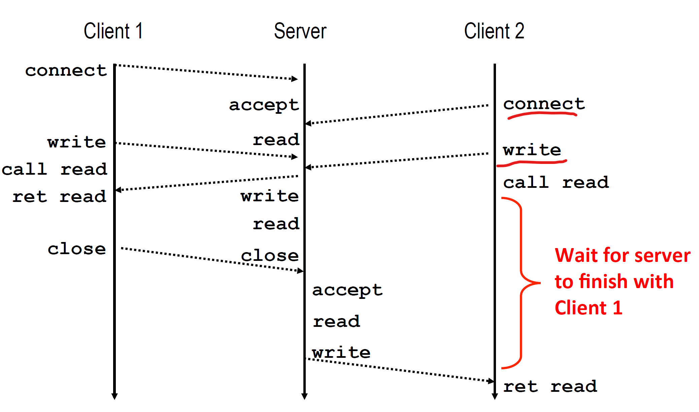
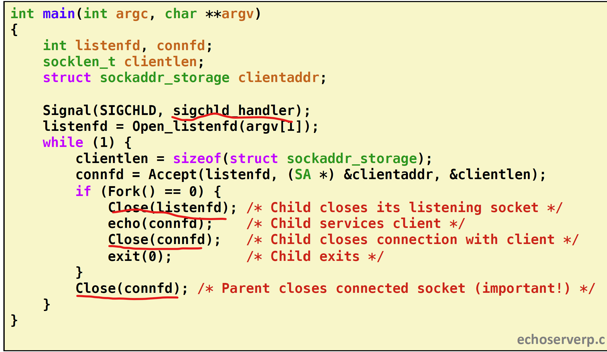
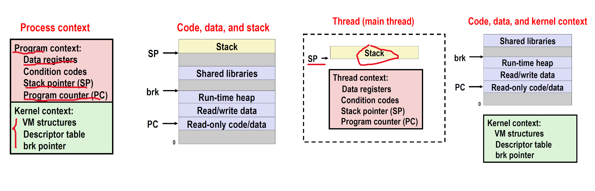
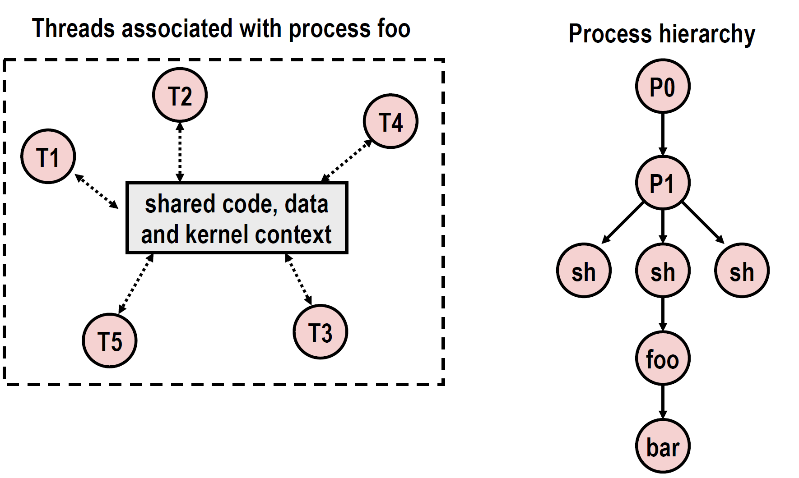
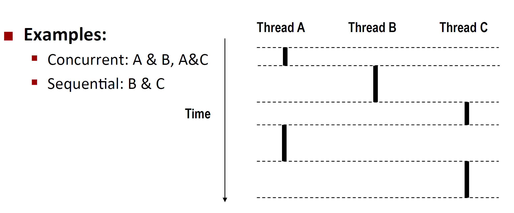
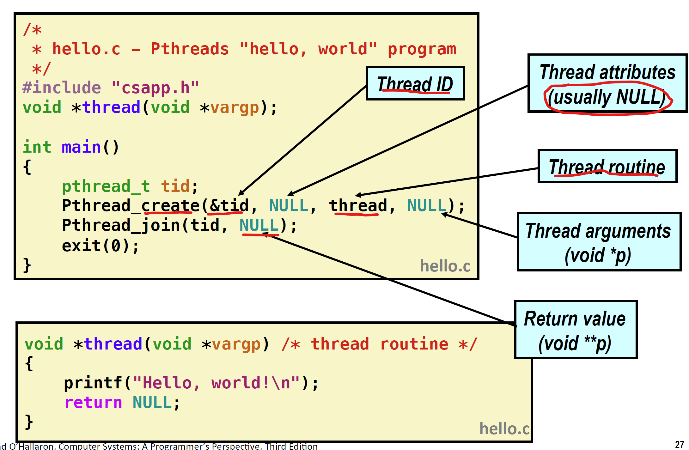
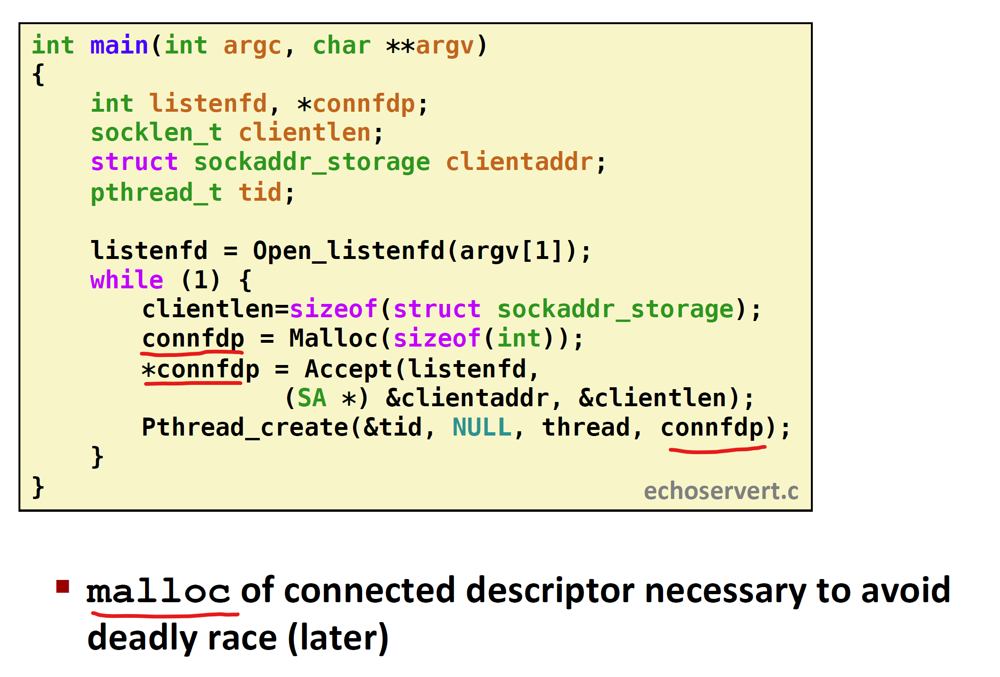
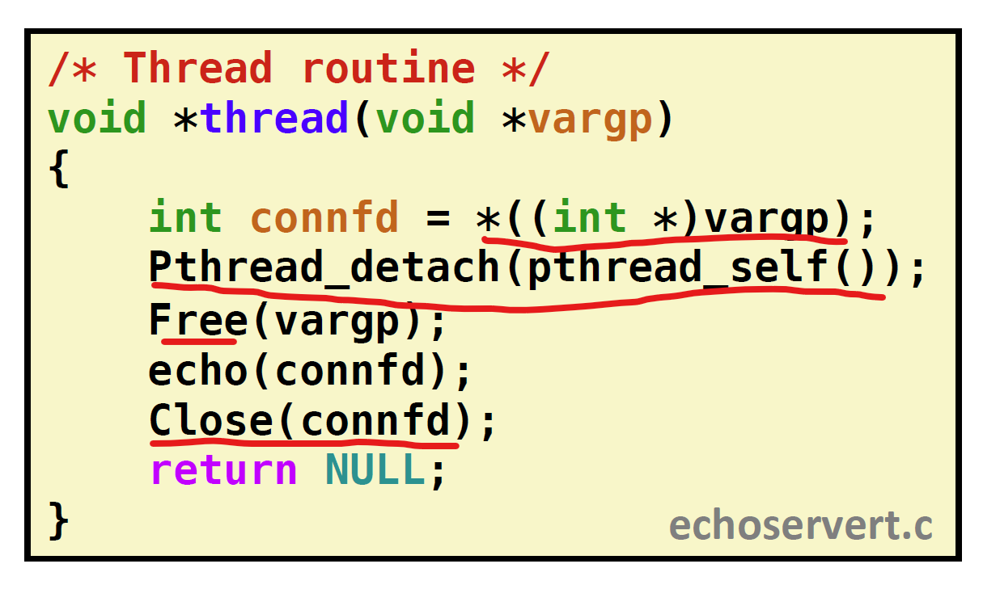

# 并发编程

## 引言

### 并发编程常见问题

并发编程容易引发错误，包括竞争，死锁，饥饿等。

### 迭代（iterative)服务器

一次只能处理一个用户的请求

可以发现：用户2真正进入等待，是在call read指令，此时用户无法得到server的数据。

用户2发出connect指令，虽然并没有建立连接，server的TCP管理程序会把连接请求入队。同理，用户2向server发出数据（write），尽管没有建立连接，TCP管理程序会先把数据填入缓存，但是在进行read时，由于server不能向用户发送数据，会进入等待。

迭代式服务器的缺点：当某一用户不能断开连接后，其他用户会永远等待。

## 并发服务器

常见的实现方法有以下三种：

1. 基于进程：内核自动控制不同逻辑流的交替，每个逻辑流都有自己的地址空间
2. 基于事件：程序员手动控制逻辑流的交替，每个逻辑流共享相同的地址空间
3. 基于线程：内核自动控制不同逻辑流的交替，每个逻辑流共享相同的地址空间，相同于事件+进程的混合。

### 基于线程的并发服务器

#### 实现方式

为每一个用户都生成一个子进程，如下所示：

#### 代码

1，需要关闭两次connfd，因为子进程会完全复制父进程的文件引用表

2，子进程需要关闭listenfd，因为子进程一般不需要监听嵌套字。

3，监听服务器需要回收所有的子进程，防止内存泄漏（memory leak）

#### 优缺点

优点：

1. 能够并发处理连接
2. 只会共享“文件表”，具有干净的共享模型（共享的东西很少）
3. 简单直观

缺点：

1. 进程控制开销
2. 进程间共享数据比较麻烦（管道？）

### 基于事件的并发服务器

#### 实现方式

服务器能够维护一个connfd数组，并能够判断其中有哪些connfd有待定的输入（pending input）（使用select,epoll函数）（待定输入的到达被视为**事件**）。

如果listenfd监听到了input，则接受连接，并添加进connfd数组。服务器能够为所有的connfd提供服务。

#### 优缺点

优点：

1. 只有一个逻辑流，一个地址空间
2. 调试方便（单步调试）
3. 没有进程/线程的开销

缺点：

1. 代码相对于进程/线程并发服务器，复杂很多（需要选择算法？）
2. 很难提供**细粒度并发**。
3. 多核系统无法发挥优势。

### 基于线程的并发服务器

#### 什么是线程

进程可以看成是：进程的上下文+代码/数据+栈。其中，进程上下文可以分为线程上下文+内核上下文。不同上下文（context）如下：

注意线程包括了**线程上下文**（寄存器数据，条件代码，栈指针，程序计数器）+**栈**，而一个进程可以存在多个线程，线程有以下特点：

1. 线程有自己的逻辑控制流
2. 线程共享代码/数据/内核上下文/地址空间
3. 线程有自己的栈，用于存储局部变量（但是heap中的数据是共享的）
4. 每个线程都要线程ID（TID）

一个进程的多个线程构成了**线程池**，而不像进程是由层次结构的。

判断并发线程也和进程类似：

#### 进程/线程比较

相似性：

1. 都有自己的逻辑控制流
2. 都能够和其他进程/线程并发。
3. 都需要进行上下文转换

不同：

1. 线程共享代码和数据（除了各自的stack）
2. 创建线程的开销更小（需要两倍的时间）

#### 线程实例

Posix线程：C语言操作线程的标准接口，定义了60多个函数。

Pthread_creat()：创建线程，执行线程routine（定义好了的函数），返回线程ID

Pthread_join()：回收线程，得到线程routine的返回值。

在线程的routine内打印hello,world.

#### 基于线程的并发服务器代码

必须得为每一次连接产生的connfd动态分配地址（不能放在stack），因为主线程和子线程的执行顺序不确定，放主线程先于子线程执行，会再次创建新的connfd，如果没有使用malloc，第一个子线程得到的connfd会被新的连接覆盖。

1. 需要对传入的connfd解引用。
2. detach：线程的状态分为joinable和detached，其中joinable表示此线程能够被其他线程控制（回收和杀死），detached表示此线程独立于其他线程运行，并由内核自动回收。默认状态是joinable，一般我们进行线程并发时，需要设置为detached。
3. 只需要closefd一次，因为线程共享文件表。

#### 优缺点

优点：

1. 线程间很容易进行数据共享
2. 比进程效率更高

缺点

共享数据具有双面性，不经意的共享数据，会造成很难察觉，很难重现(随机性)的bug!!因为很难判断哪个数据是私有的，哪个数据是共享的。