# 异常控制流

## 异常控制流定义

### 什么是控制流

从计算机启动到关闭，CPU做的仅仅是处理一系列**顺序**的指令，一次一条。这个顺序指令叫做CPU的控制流。

### 如何改变控制流

迄今为止已经学习了软件方面的控制流改变：1，branches/jumps 2，call/return。这两种改变都是针对“程序状态”

对于“系统级状态”的改变，控制流应该如何处理呢？比如磁盘数据上载到内存，或者程序除以0，或者键盘按下ctrl+c，或者**系统计时器**终止等等，控制流需要靠“异常控制流”的机制应对。

### 异常控制流

存在于计算机的各个层级，分别如下

1. 异常：当发生了系统事件（system event）时，比如系统状态改变等，需要产生一个“异常”来处理，需要硬件和操作系统软件的配合
2. 进程上下文转换：需要硬件计时器和操作系统软件配合
3. 信号:由操作系统软件控制
4. 非本地跳转：由C的runtime library控制

## 异常

### 定义

异常是指为了响应某一**事件event**，控制权由当前执行的程序转移到操作系统内核（OS kernel）

内核：操作系统内存常驻部分

常见**事件event**：除以0，计算溢出，页缺失（page faults），I/O请求完成，键入ctrl+c等等

**事件**处理过程如下

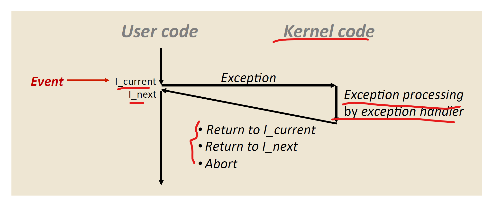

可以发现：在kernel的异常处理器处理完成了，有三种情况。

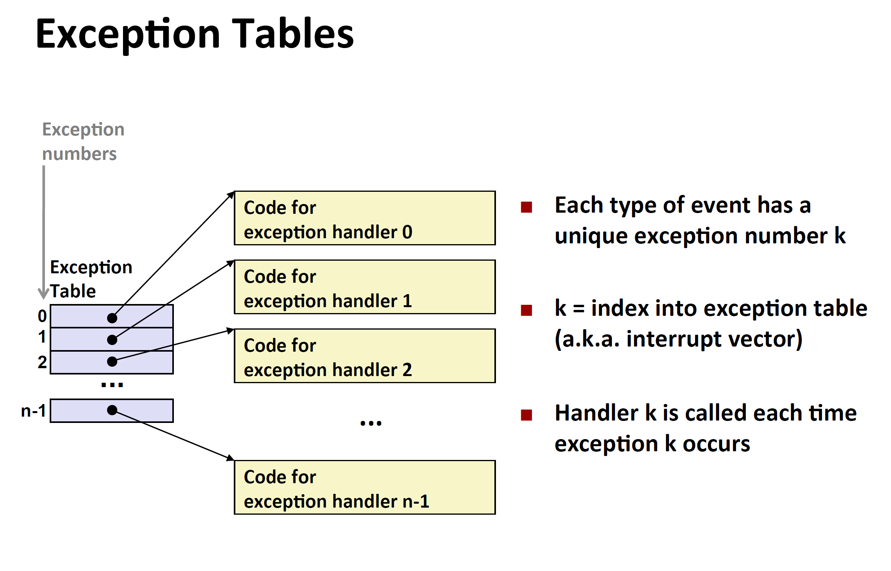

可以发现：内核中有一张异常表，每一种事件都对应着一个编号，供查到对应的处理程序。

### 异常分类

#### 异步异常

发生在处理器外部的事件引起的异常，通过处理器的中断引脚（interrupt pin）传给处理器，并且异常处理器（exception handler）完成后，会接着处理原控制流的下一条指令（next）

举例：

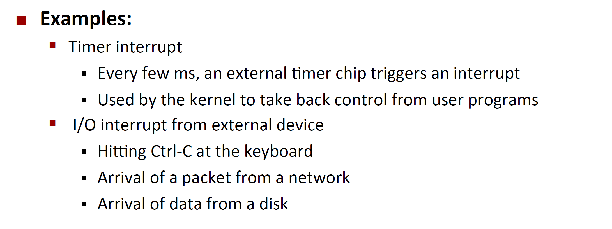

可以发现：timer interrupt可以帮助内核掌握控制权。

#### 同步异常

由于执行某一条指令发生的异常

分类：

陷阱traps,错误faults，中止aborts。

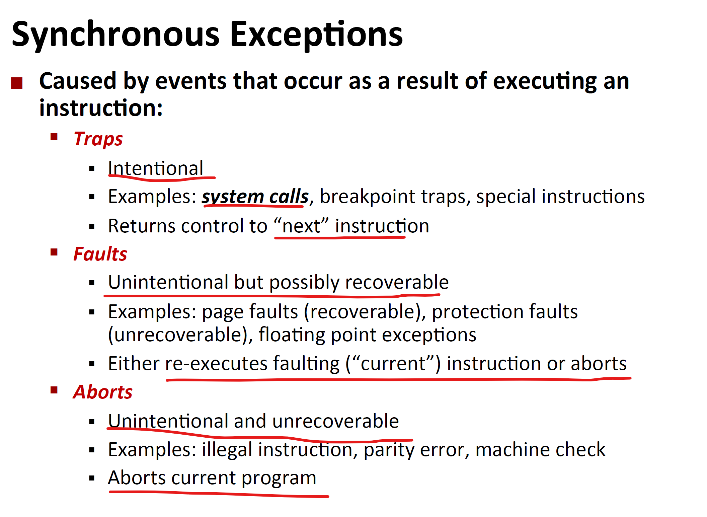

可以发现：traps可以恢复，且是当前程序主动请求的，比如请求system call系统调用，来调用系统函数，faults不是主动请求的而是不可能预测的，发生faults时，程序后能会在原处（不是next）接着重新运行，也可能中断

常见system call符号：

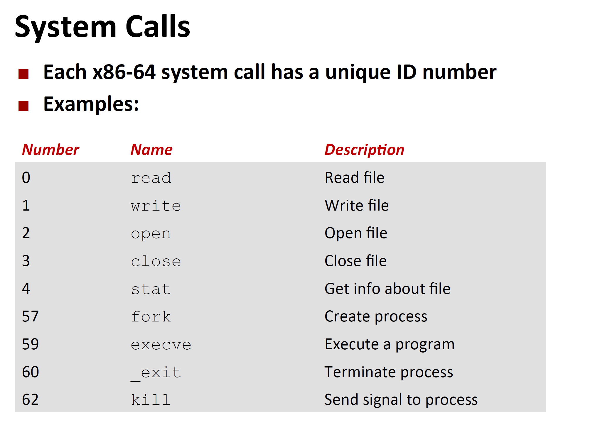

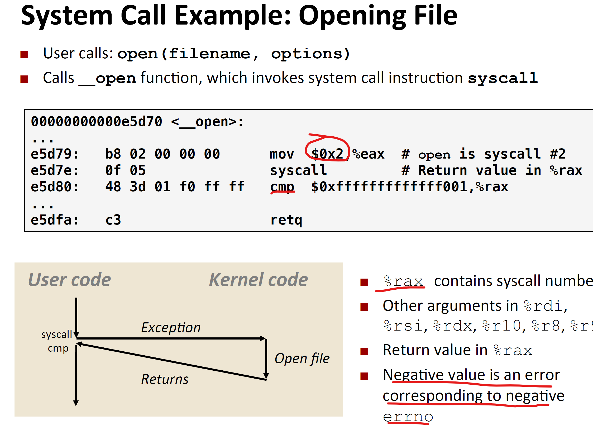

上图为系统调用举例

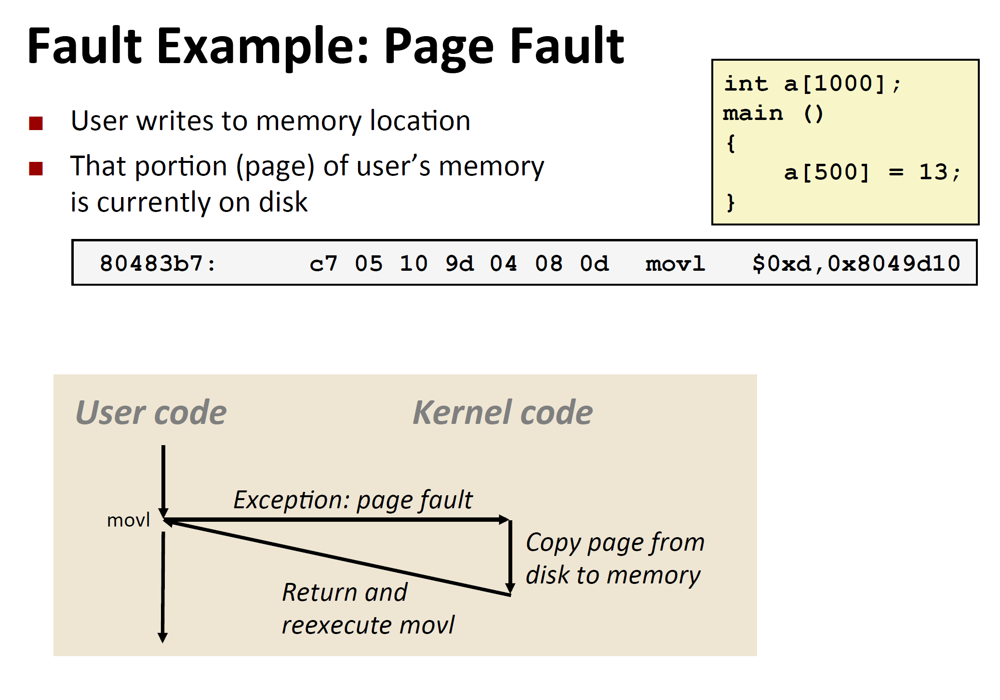

上图为页缺失举例：当前内存没有所需要的地址a[500]，从磁盘中调用

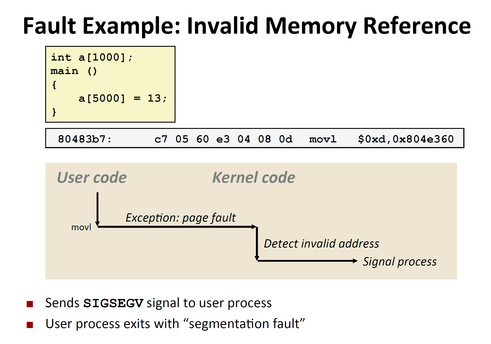

上图为页缺失的另一种情况：当为错误地址时，发出signal

## 进程

### 进程定义

定义：进程是指运行程序的一个实例（因为运行的程序可能有多种存在形式，比如.c,.o,.text或者加载到了内存中）

两大关键抽象

* 逻辑控制流：每个进程看上去都在单独的在使用CPU，通过OS的”上下文切换“机制产生
* 私有地址空间：每个进程看上去都在单独的使用内存，通过”虚拟内存“的机制产生。

多进程的假象：看上去同时运行着多个进程，每个进程都在使用CPU和内存。

传统单核处理器处理多进程：交错处理，进行多进程转换时，先把当前**寄存器中的值和地址空间存**在内存中，然后转到另一个进程执行，当执行另一个进程时，把那个进程之前存好的寄存器值和地址空间读取出来即可

现代多核处理器处理多进程：依然是共享内存和一些缓存，但是每一个核都可以处理一个进程了，进程数超过核心数，也要进行**上下文切换**

多进程的并发性：如果在进程A的逻辑控制流核进程B的逻辑控制流时间交叠，则称这两个进程是并发的（实际在物理层面，它们并没有交叠）比如下图

A/B,A/C**并发**，B/C**顺序**

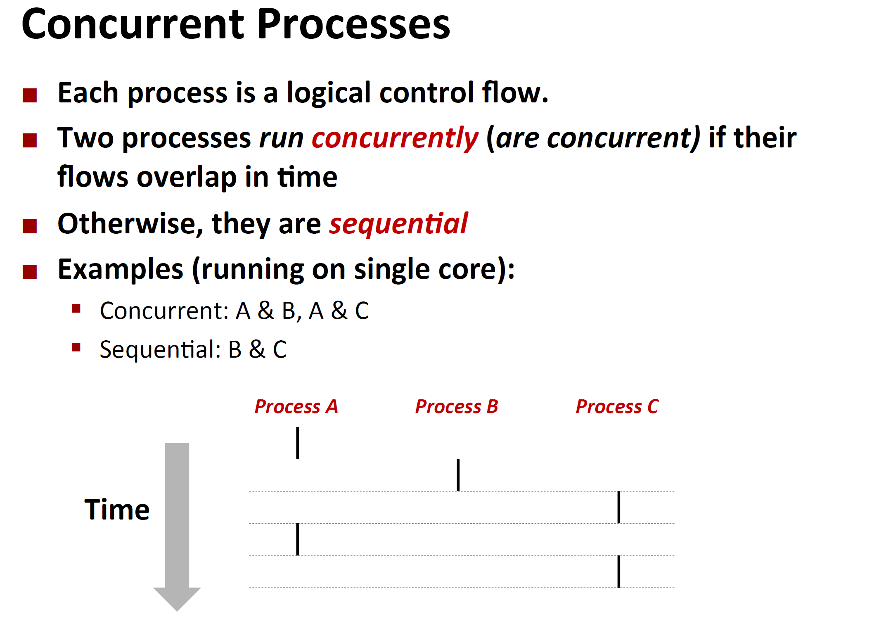

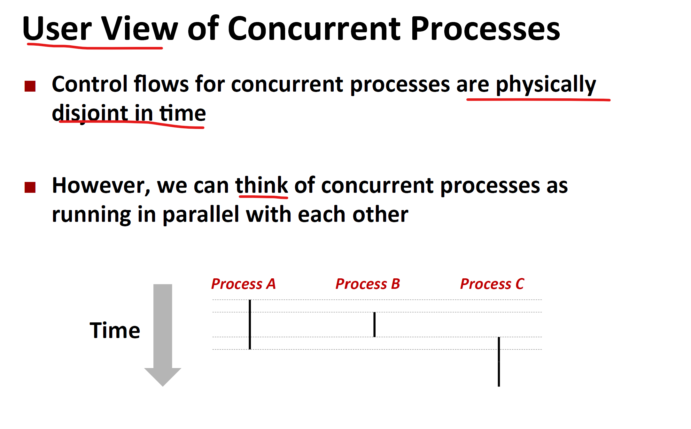

上下文切换：由操作系统内核控制着进程及上下文切换（注意内核不是单独运行的进程，而是作为某些进程的一部分在运行着）

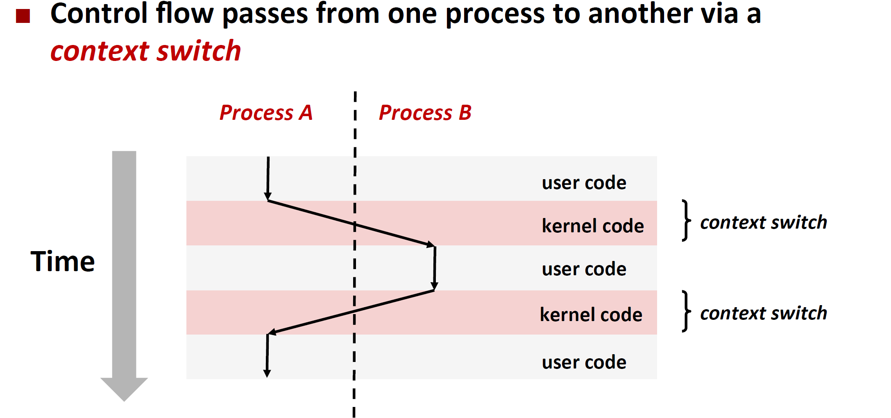

### 进程控制（操作进程）

------

#### 系统函数调用错误

调用系统函数（system call）规则：一定要检查系统函数的返回状态！除了那些返回值为void的系统函数

处理系统函数调用错误：通常系统会会设置errno来表示错误原因，并返回-1。如下图调用fork()

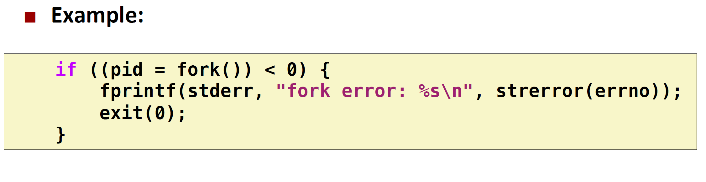

可以使用错误报告函数unix_error来简化错误报告。

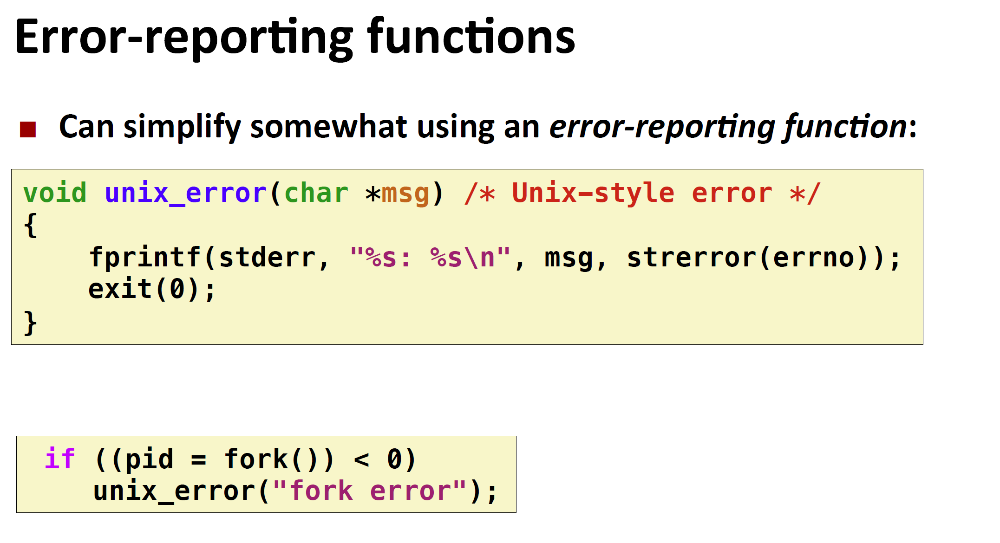

也可以使用错误处理包装来包装系统调用函数

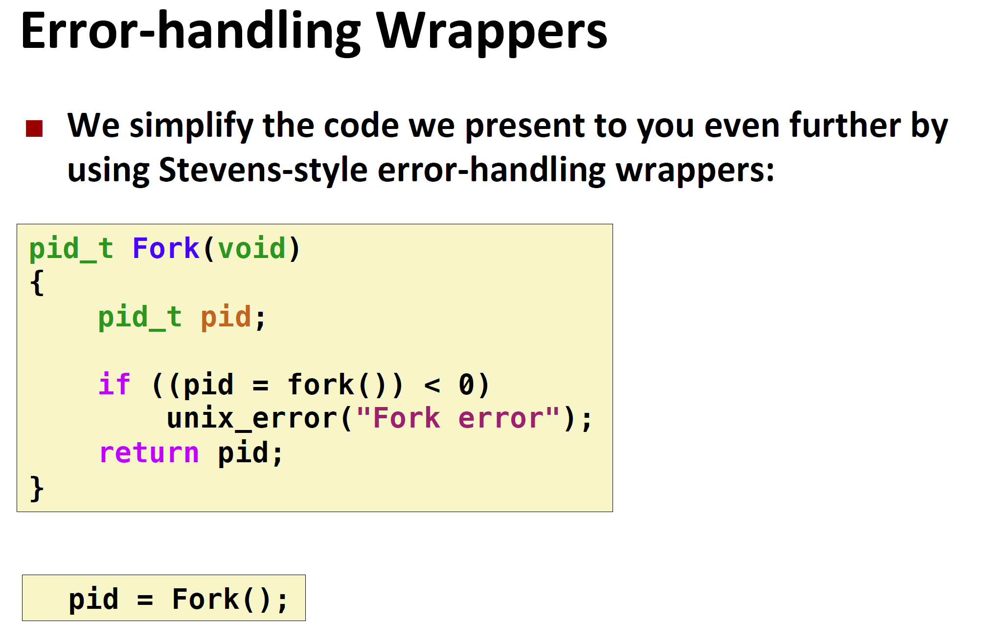

#### 获得进程ID

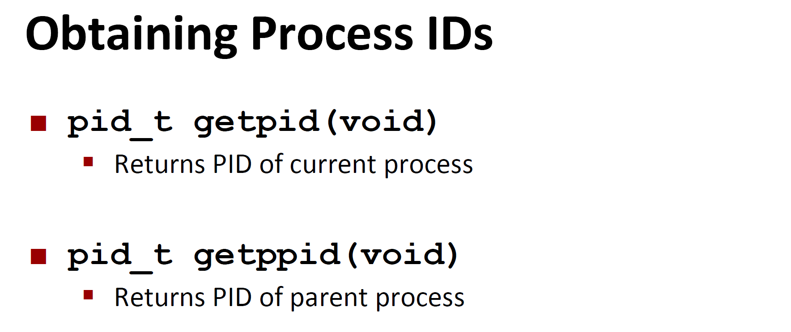

#### 产生/终止进程

从程序员角度，我们可以把进程状态分为三种：

1. 运行：正在运行或者准备运行（已经内核被安排上）
2. 停止：进程被某个信号停止了（suspended）并且不会被安排运行，直到收到**信号**
3. 终止：永久停止了

进程终止原因：

1. 收到某个信号
2. 在main函数中return了
3. 调用exit()函数

exit()函数：特殊的函数，一旦调用，永远不会返回。（但是可以从main函数中return 一个状态值）

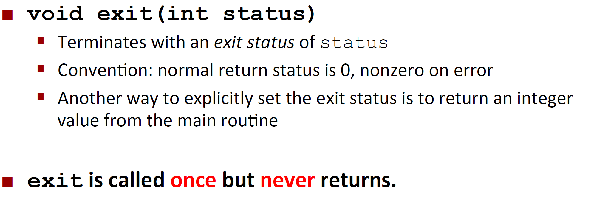

产生进程：使用fork()函数产生新的子进程（child process）

**fork()函数详解**

1. 子进程获得父进程的一模一样的虚拟内存地址的副本，但是PID和父进程不同
2. 调用一次fork()，会return两次（子进程，父进程各return一次）
3. fork()在子进程中return 0，在父进程中return子进程的PID
4. **不能预测子进程和父进程哪个先执行**

#### 使用进程图分析fork()

使用进程图，可以方便我们分析当前并发程序（假并发）中，语句的执行顺序

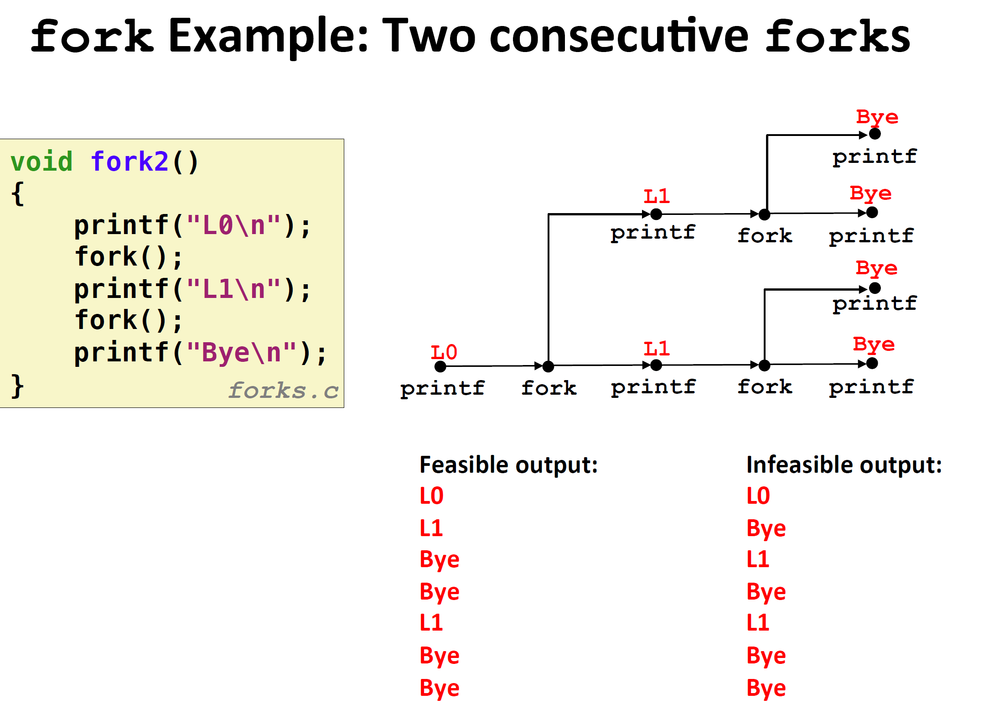

可以发现语句执行顺序为拓扑结构，由于可以进行上下文切换，有多种可行的执行顺序。

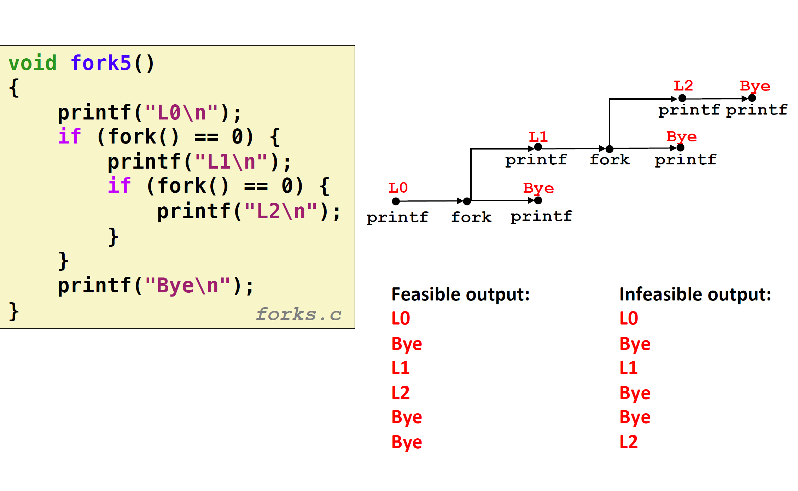

#### 子进程回收

当子进程运行完后，依然占用着系统的资源（包括exit status退出状态，OS表等），称为僵尸（半死半活）

父进程需要对僵尸进行回收：使用wait/waitpid函数，父进程能够得到子进程的退出状态（exit status），然后内核清理僵尸子进程。

如果父进程没有回收，父进程终止后，那些僵尸进程会被init 进程（pid == 1）回收，但是我们需要显式的回收长期运行的进程（比如shell/servers）

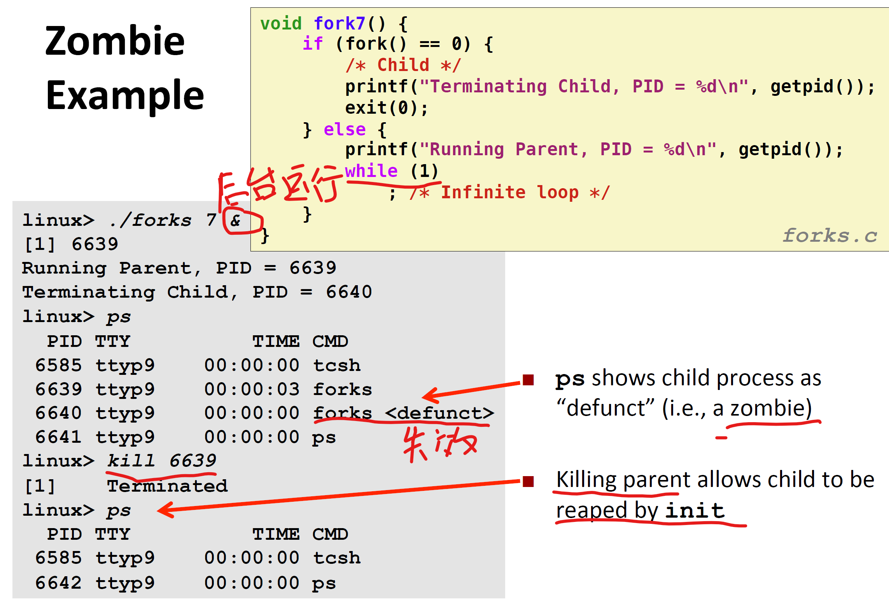

上图为子进程长期运行的例子（可知我们必须**显式的终止**长期运行的进程）

**我们可以使用wait来回收子进程（与子进程同步）：**

当child_status非空时，会指向一个子进程的退出状态，根据此状态，可以确定有**某个**子进程终止，还能确定退出状态（终止状态？）

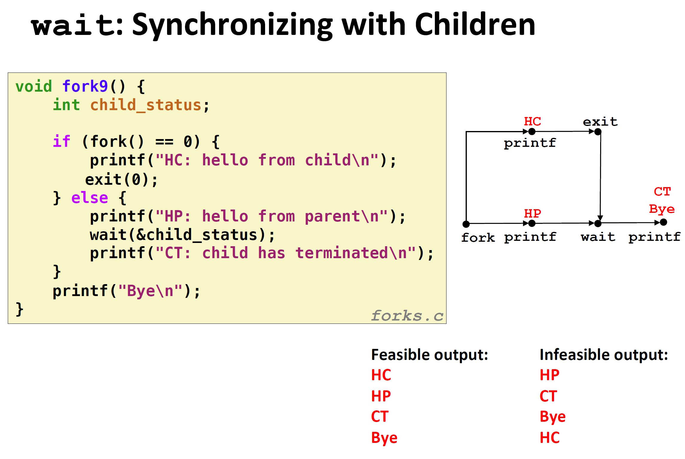

#### 加载并运行新程序

execve()允许当前进程的上下文中加载并允许新的程序

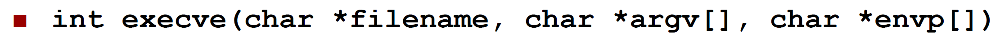

其中：filename:为可执行文件：如.o文件或者脚本文件（通过解释器如shell,bash等允许命令行，通常是以#! intepreter 比如#! bin/bash开头）

argument[]以null结尾，指向一系列参数字符串，通常第一个为需要指向的文件名，之后为命令行指令参数。

envp[]以null结尾，指向一系列环境变量，形式："name = value"

重点：会覆盖原有进程的code/data/stack！！！但是保留了PID，打开的文件，信号上下文？？

特点：此函数如果不报错（也就是只要filename指向的程序能够运行）就不会在执行进程中的原程序了，也就是**call once and never returns**。

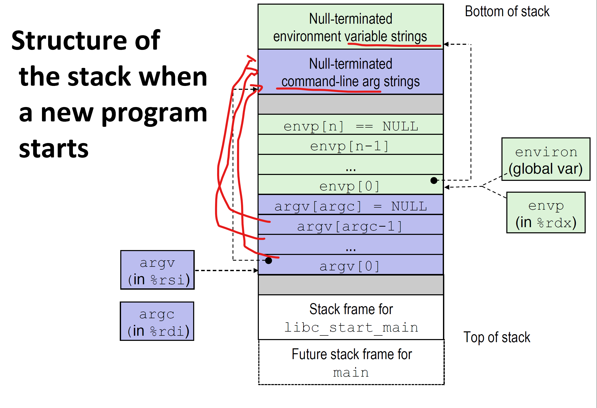

在Main的stack frame的头顶，会存放着我们调用execve()是的参数，比如argu[]和envp[]等（与传统直接调用Main不同的点?)

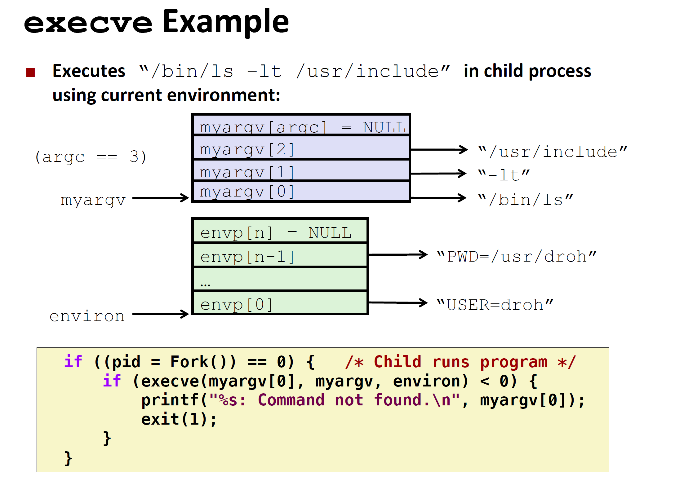

可以发现执行”bin/ls -lt /usr/include“这条命令，会分成三段放在argv[]里面，（注意调用系统函数还是要检查返回值。。)

