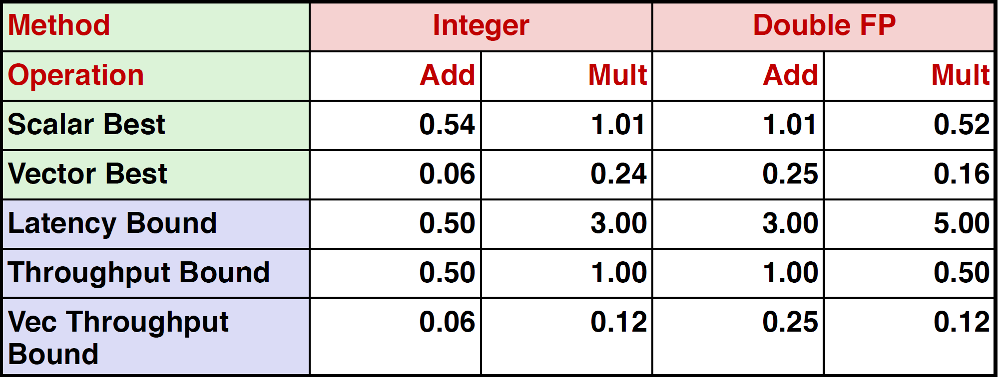
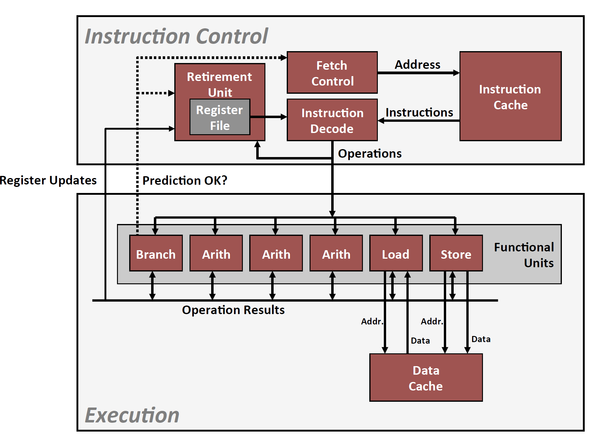

# 程序优化（常数级别优化）

## 引言

* 不涉及算法优化，有时候常数级别复杂度也可以优化性能
* 目的：写出编译器友好的代码
* 可针对通用机器优化，也可以针对特定机型机型优化
* 使用汇编不一定能使程序变得更快，汇编可以用于一些算力优先的场景
* gcc编译器对于大多数情况性能已经足够好
* 编译器优化的一些限制条件：1,当存疑时，编译器选择不优化。2，一般只在单个procedure中优化（最新版的GCC可以interprocedual，仅限于单个文件）3，编译器只对静态信息优化。

## 编译器常用优化手段

1. 代码移动/代码预先计算：将循环中需要反复重复计算的相同表达式提取到循环外，用局部变量存储，从而减少计算次数
2. 减少计算量：乘法->加法，乘法->移位，因为乘法需三个CPU cycles
3. 公用公共子表达式：减少计算量

## 编译器优化阻碍

1. 不能对函数调用进行优化（procedure calls）

   * 编译器对待procedure就像黑盒子一样

   ```
   void lower(char *s)
   {
       size_t i;
       for(i = 0; i < strlen(s)); i++)
           if(s[i] >= 'A' && s[i] <= 'Z')
               s[i] -= ('A' - 'a');
   }
   //可以发现多次对strlen函数进行重复调用，但是GCC不会对此进行优化
   //O(n^2)
   ```

2. 内存别名（Memory Aliasing）

   **别名**：两个不同的内存引用，指向同一个地方

   别名的存在，可能会增加**内存访问次数**（用来保存变量），所以要养成使用局部变量的习惯。

## 探究机器级指令的并发性

定义如下数据类型和基准计算，尝试优化代码

```c
/* data strcutre for vectors */
typedef strcut{
    size_t len;
    data_t *data; 
}vec;

/* retrieve vector element and store at val */
int get_vec_element(*vec v, size_t idx, data_t *val)
{
    if(idx >= v->len)
        return 0;
    *val = v->data[idx];
    return 1;
}

/* Benchmark Compuatation */
void combinel(vec_ptr v, data_t *dest)
{
    long int i;
    *dest = IDENT;
    for(i = 0; i < vec_length(v); i++){
        data_t val;
        get_vec_element(v,i,&val);
        *dest = *dest OP val;
    }
}
/*
OP/IDENT 都是宏（macros），可以为加法或乘法，
data_t可以为多种类型如int,long,double等
*/
```

- 未优化的写法：如上所示，每次取元素时都要进行边界检测

- 基本优化法：只进行一次取元素：取指向vec首元素的指针，然后进行指针运算，即可遍历vec，减少了调用procedures的次数

> 现代CPU设计：可以一次性读取多条机器指令（Instruction cache），判断指令间的相关性，对相互间不影响的指令可以同时执行，从而达到一个机器周期能执行多条指令的目的，称为**超标量指令处理器**（Superscalar processor)

> 流水线型（pipeline)功能单元：乘法操作需要三个机器周期，分成stage1,stage2,stage3，但是在运算stage2时，可以让乘法单元的stage1进行新一轮的乘法操作，这样乘法单元的三个stage能尽可能繁忙，减少运行时间。

> Haswell CPU一共有8个功能单元：包括2个加载单元，一个存储单元，4个整数单元，2个浮点乘，一个浮点加，一个浮点除。
>
> 每个算数运算所需时间可以由延迟（latency），发射时间（issue time），容量（capacity）描述，其中延迟表示一个计算单元计算一次所需时间，发射时间表示计算单元进行一次新的加载（or发射）需要几个机器周期，容量表示处理该运算的运算单元有几个。

* 循环展开优化法：将循环体内部的单次运算编程可以并行(or pipeline)的多次计算，使得一个机器周期尽可能计算多的计算。

```c
//未展开:不能进行pipeline
t = t OP d[i];
//2*1展开:也不能pipeline，计算顺序没有变化
t = (t OP d[i]) OP d[i+1];
//2*1a展开：可以pipeline,运行时间减半
t = t OP (d[i] OP d[i+1]);
//2*2展开：pipeline，与上面方法类似,two independent streams of operations.
x0 = x0 OP d[i];
x1 = x1 OP d[i+1];
```

* 使用向量指令优化：向量指令可以使一次机器循环执行多个操作，基于YMM寄存器（32位/64位），向量化编程主要用在声音，图像处理，视频等浮点数领域。

**优化对比：**



其中Integer的吞吐量因为只有两个加载单元，限制为0.5而不是0.25.

## 避免难以预测的分支判断


现代处理器设计图：



其中需要对条件分支进行prediction，由于运算出来的寄存器结果都存在register file（寄存器缓存中），每个寄存器可能都缓存了之前几百次计算结果，当prediction出现错误后，需要返回将寄存器都返回到某一状态，从而造成时间浪费。