# 网络编程

### 前提

重点讲编程，网络的数据如何传输，路由器，集线器，以太网，局域网等等知识，看“计算机网络”即可。

一些图：

### 协议

由于存在着不同的LANs和不同的WANs，数据应该怎样在不同的设备上传输呢？

解决办法：每一台主机或者路由器上，都有一层协议软件，能够帮助不同主机和路由器之间进行数据传输（比如一致的命名方式，唯一标识主机），还能够消除不同网络的差异（不同网络可能采取不同的数据封装方式，协议提供统一的封装格式，帮助网络间的通信）总的来说，协议做了两件事：

1. 提供了命名机制
2. 提供了传输机制（标准传输单元：包）（包包括：头部/有效部位）

**数据通过封装在网络中传输**

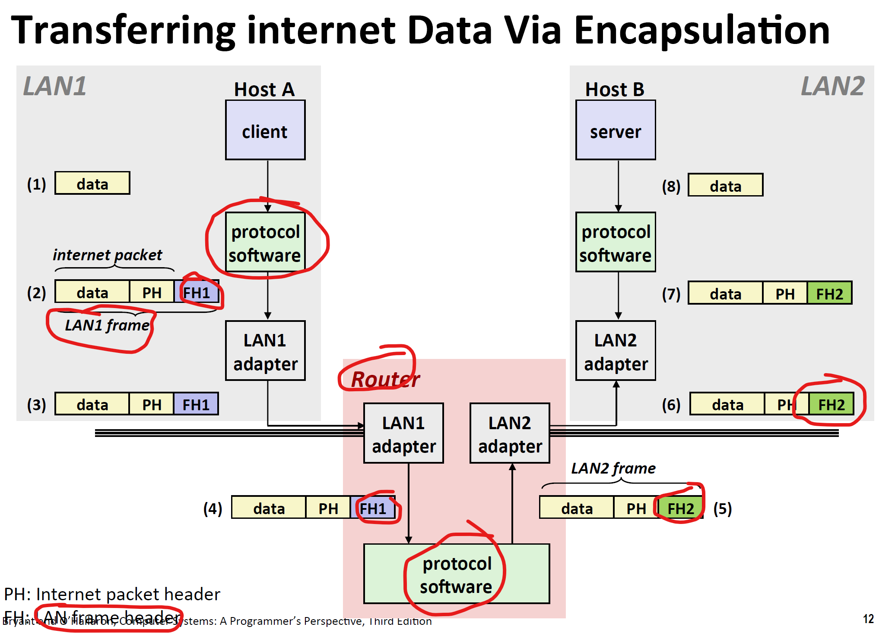

注意：路由器会对发来的数据报（包）进行重新封装（添加了FH2）

### 因特网

基于TCP/IP协议族：

其中IP提供了基本的命名机制以及提供**不可靠的主机-主机间**的数据报（包）传输。

UDP：使用IP来提供**不可靠的进程-进程间**的通讯

TCP：使用IP来提供可靠的比特流，进程-进程间，通过连接。

**英特网应用程序**：

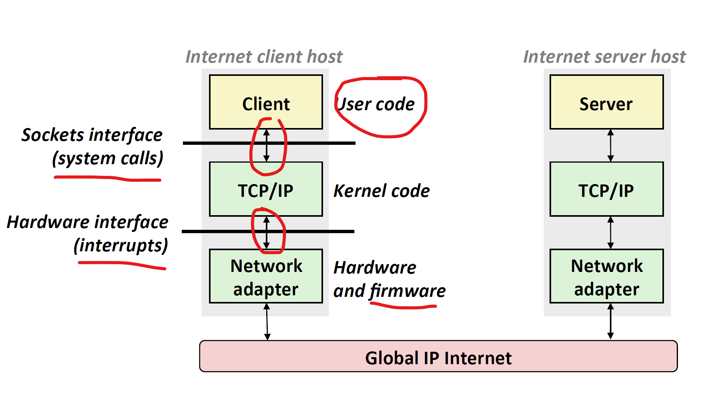

在程序员眼中，一个主机和一个IP地址对应，IP地址和域名对应（如www.google.com对应着特定的IP地址）不同主机的进程可以通过连接（connection）进行通信。

**IP地址**

32位，存储在IP address struct，并且是大端序列。

32位的IP地址还可以用点分割的十进制表示，两点之间的数为一个字节（最大255）

**域名**

域名有多个等级，并由DNS（域名系统）管理，DNS能够维护IP地址和域名的对应，是一个很大的分散数据库。

在程序员严重，DNS就是有着很多主机项（host entries）的数据库，每条主机项对应着域名和IP地址的映射。

使用nslookup可以查询主机项。比如：nslookup localhost可以得到路由器的回环地址（loopback address）

nslookup hostname：获得本机真实域名 nslookup www.google.com获得谷歌的IP地址（可以发现多次查询会不同）

**因特网连接**

用户和服务器通过连接进行通信，连接的特点：

1. 点对点：连接着一对进程
2. 完全双向：能够在同时双向传递数据
3. 可靠

socket：连接的终端：**一个socket由IP地址加上接口(port)组成。**

接口(port)：16位（两个字节），用来表示进程，常见的接口有：随机接口（用户端的内核把随机接口自动的分配给进程）。著名接口：与常见的一些服务进程相关（如port 80：表示网页服务）

常见接口：echo server：7/echo，ssh server :22/ssh，email server：25/smtp，Web servers：80/http

可以在/etc/services中查询这些常见接口（Linux）。

什么是连接：一条连接和一组socket对一一对应（socket pair），如下图表示了两条不同的连接：

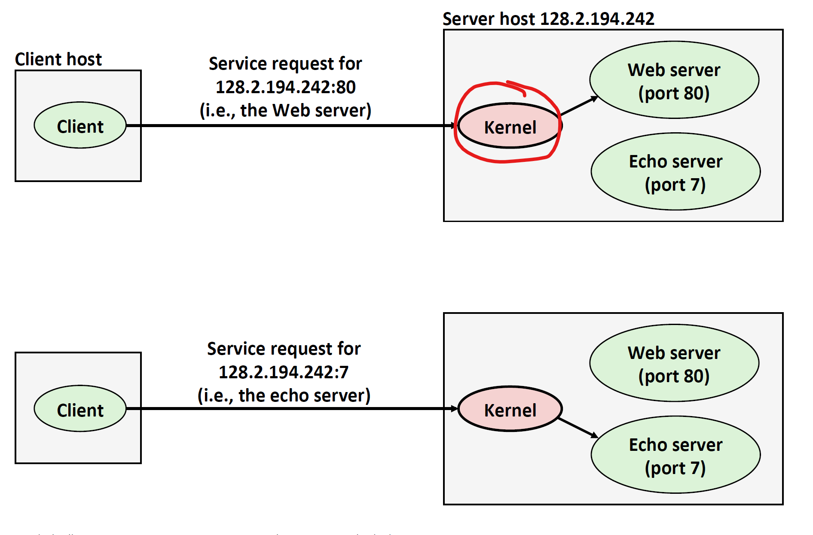

### Socket

#### 定义

socket对于内核来说，是“连接”的端点。对于应用程序来说，是**文件描述符**，也就是说应用程序可以通过socket进行数据读写。socketI/O和普通文件I/O的区别在于：其打开方式不同

用户和服务器通过socket描述符进行通信，如下所示：

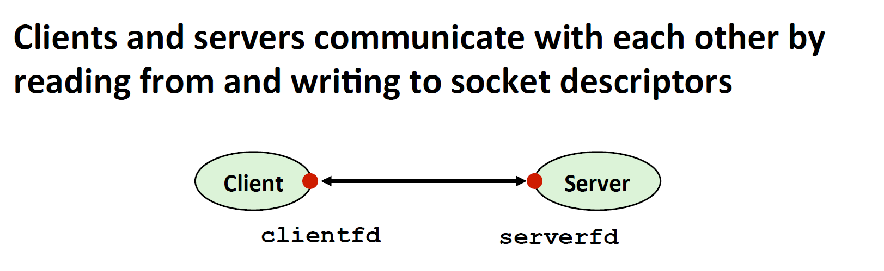

socketI/O和普通文件I/O的区别在于：其**打开方式**不同

#### Socket地址结构

普通Socket地址结构，如下：

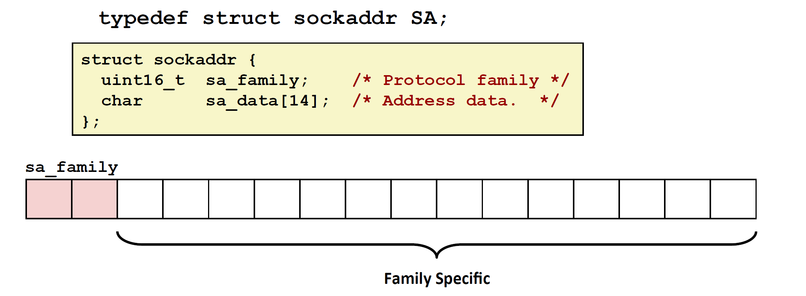

因特网特定socket地址结构：（可以看成socket的子类，但是C没有子类的概念。。）

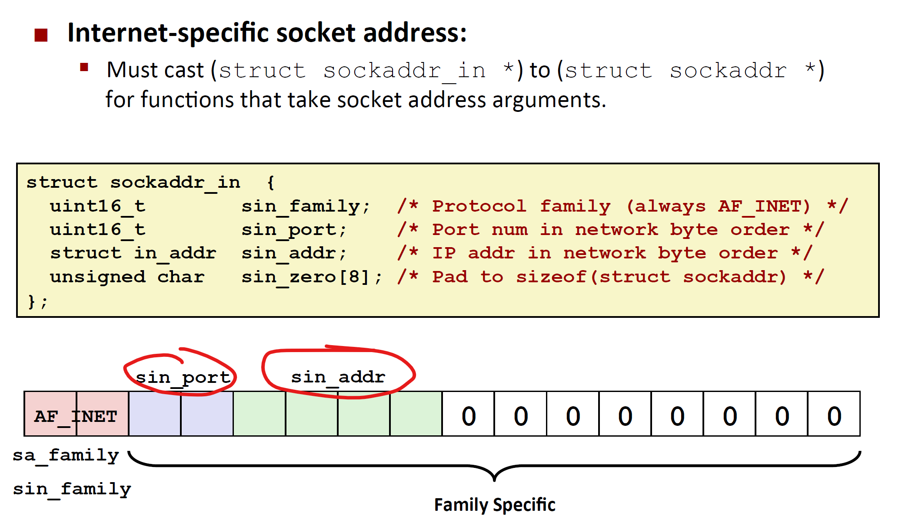

#### Socket接口（重点）

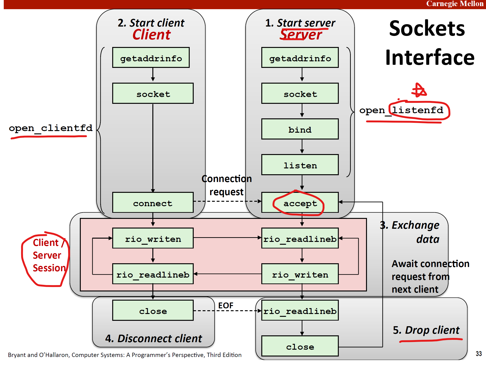

值得注意的地方：

1. 第一步是要先打开server的listenfd，之后再打开client的clientfd。
2. 连接是connect和accept的连接

**常用函数和数据结构**

* **getaddrinfo**

用于将“主机名/接口/服务”等转换为socket（套接字）地址结构，返回的地址结构被result指针指向。

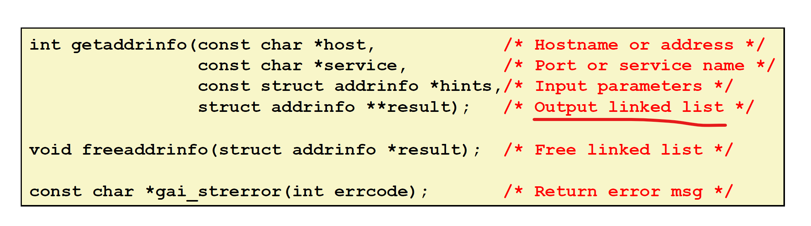

返回的result指针指向的是一个socket地址结构的链表

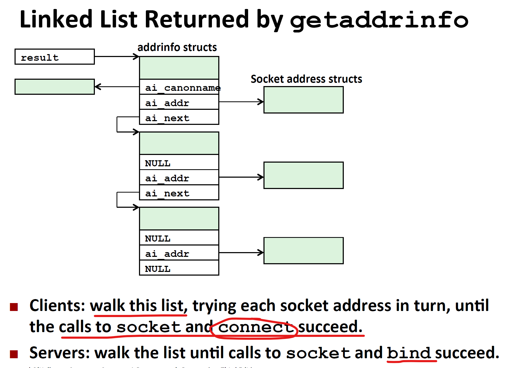

* **addrinfo**

socket地址结构，包含有用于socket函数和connect/bind函数的参数。

举例：hostinfo.c：用于得到输入的网址的ip地址：

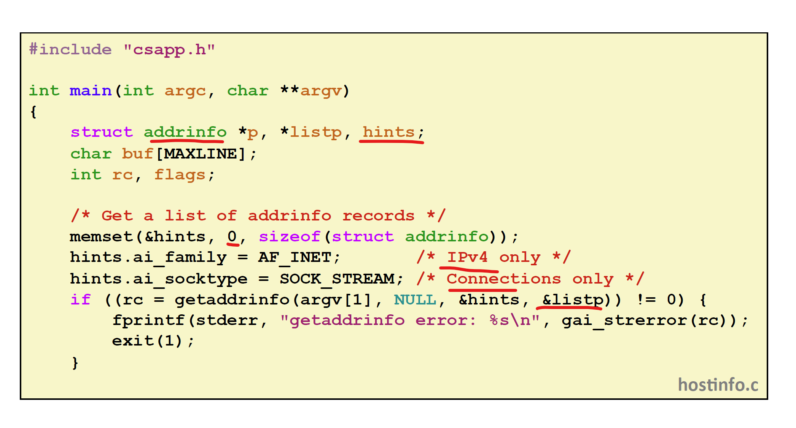

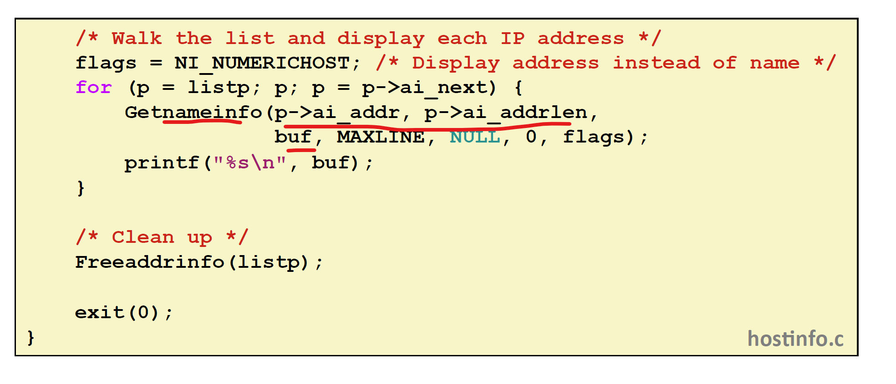

* **socket()**

作用：得到socket描述符

格式：int socket(int domain, int type, int protocol)

注意：由于创建的socket与协议相关，最好的方式是使用getaddrinfo来自动生成所需参数。

* **bind()**

作用：将服务器的socket地址和之前得到的socket描述符关联起来。

格式：int bind(int sockfd, SA *addr, socklen_t addrlen)；

注意：使用getaddrinfo来得到地址和地址长度。

* **listen()**

作用：将active socket转换为listening socket。

因为默认情况，内核会认为从socket函数得到的描述符是用户端的，是激活状态的socket。

通过listen()函数，server可以告诉内核，这个描述符是服务器端的。把active socket转换成listening socket。

* **accpet()**

作用：等待与用户连接，连接成功返回连接描述符

服务器通过调用accept()函数，可以等待连接，参数是：listenfd,用户的socket地址和长度。返回值是**连接描述符**

注意：为什么要多出一个连接描述符呢，因为连接描述符是用户和服务器建立连接后的断点，而监听描述符仅仅是用来接受用户的连接请求。通过创建多个连接描述符，服务器可以同时和多个客户建立连接（比如可以每次收到连接请求后，fork新进程来与用户建立连接）

* **connect()**

作用：用户调用，与传入地址所在的服务器进行连接

格式：int conncet(int clientfd, SA *addr, socklen_t addrlen)

注意：最好使用getaddrinfo函数来获得地址参数。

#### socket应用举例（helper）

* **open_listenfd**

返回clientfd并与server的hostname和port建立连接

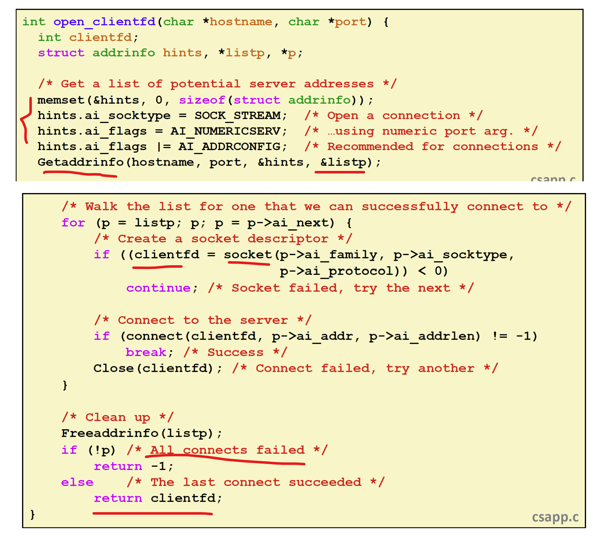

如上所示为client和server建立连接的过程：

1. 初始化Hint，然后根据hostname和port得到储存着地址信息的list
2. 测试list中的信息，看看是否能建立连接（先socket再connet）
3. 如果p没有到链表末尾，则说明成功建立连接，返回clientfd

注意：socket（）函数仅仅是返回一个client的文件描述符，并没有与服务器建立连接。

* **open_listenfd**

使当前的server所用port处于监听状态，返回listenfd。

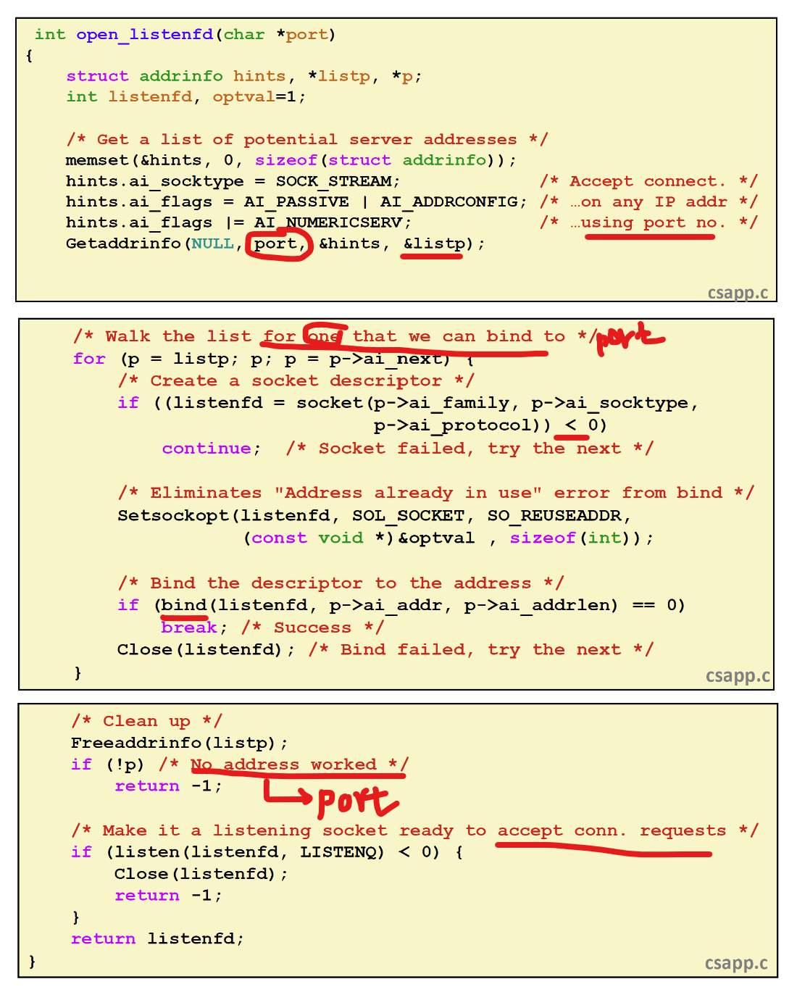

### Echo client/server

#### Echo Client

代码如下：

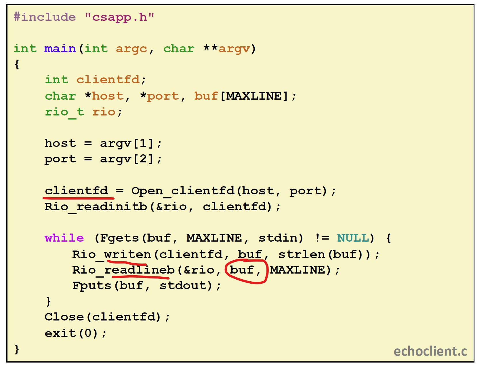

其中：使用open_clinetfd与服务器建立连接，使用RIO处理输入输出，从而提高效率，使用writen来**发送**数据，使用readlineb来**读取**数据。

#### Echo Server

代码如下：

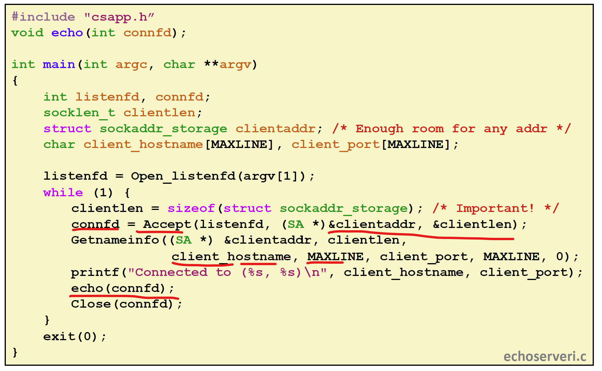

其中：使用accept获得client的地址，以及connfd。使用getnameinfo可以获得client的主机名和地址，使用echo来读取发送来的字符串长度，并将发送来的数据**回送**到client

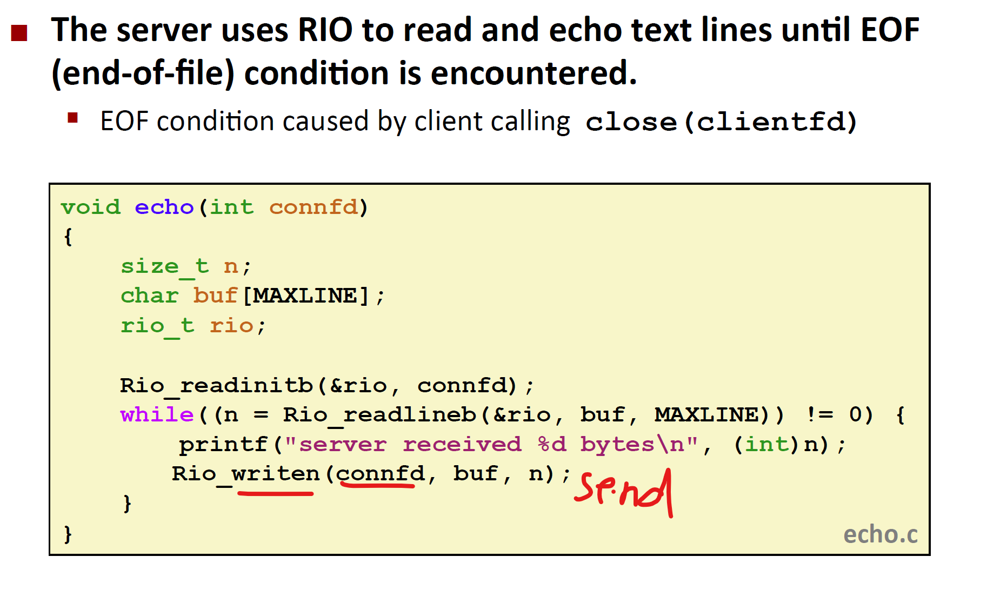

#### telnet

使用telnet程序可以向服务器传输字符串

linux> telnet <host><portnumber>

### Web server

#### 基础

用户端（浏览器）和网页服务器使用http协议传输数据，传输过程如下：

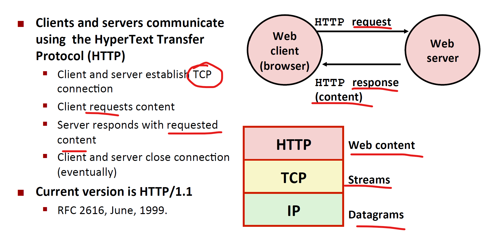

#### Web content

web content为MIME格式的字节串，常见的requested content如下：

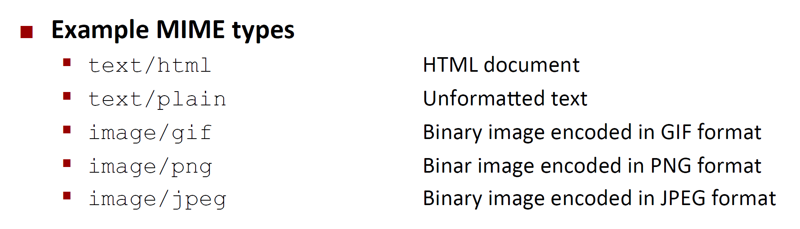

网页内容分为静态和动态两种，静态内容为一些文件，图像等等，动态内容则需要用户端传入参数，服务器用参数运行用户指定的程序，将结果返回给用户端，但总的来说，网页内容就是服务器管理或产生的一个文件。

URLs：universal resource locater。如http://www.cmu.edu:80/index.html。

#### HTTP request

格式如下：

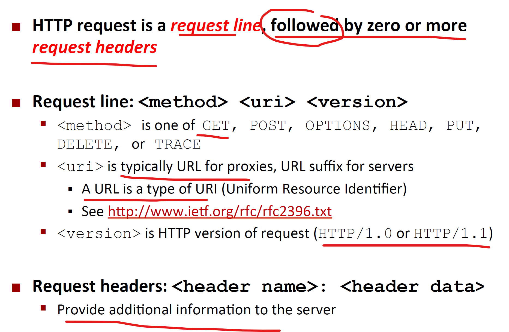

#### HTTP response

格式如下：

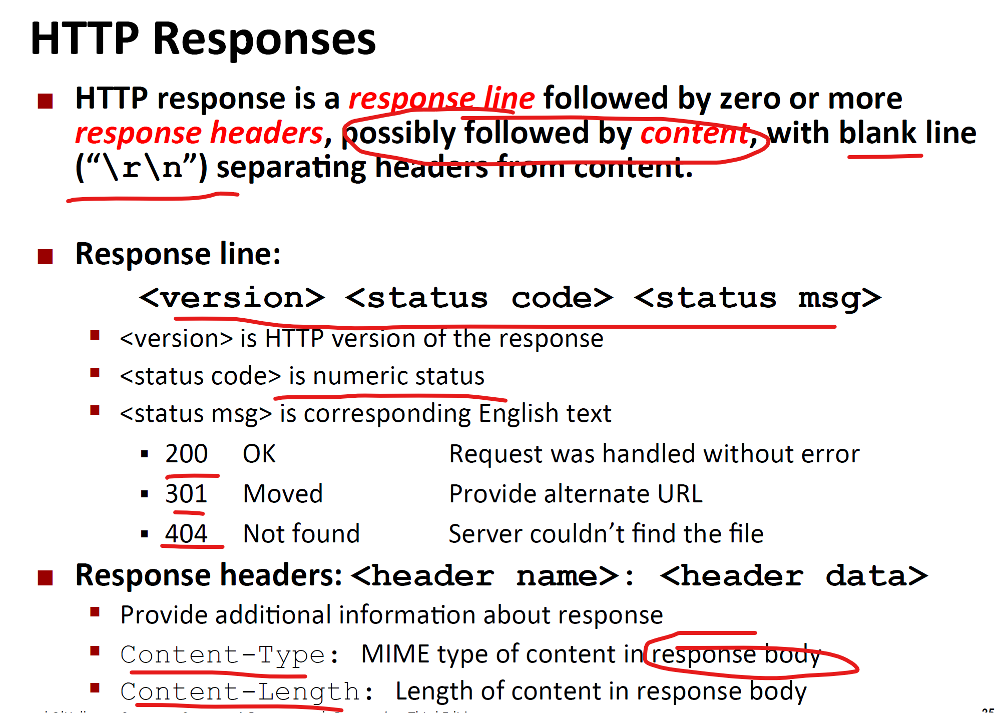

#### Tiny Web Server

非常简单的服务器，能够返回静态内容和动态内容，只有239行C代码。

* 静态内容代码如下：

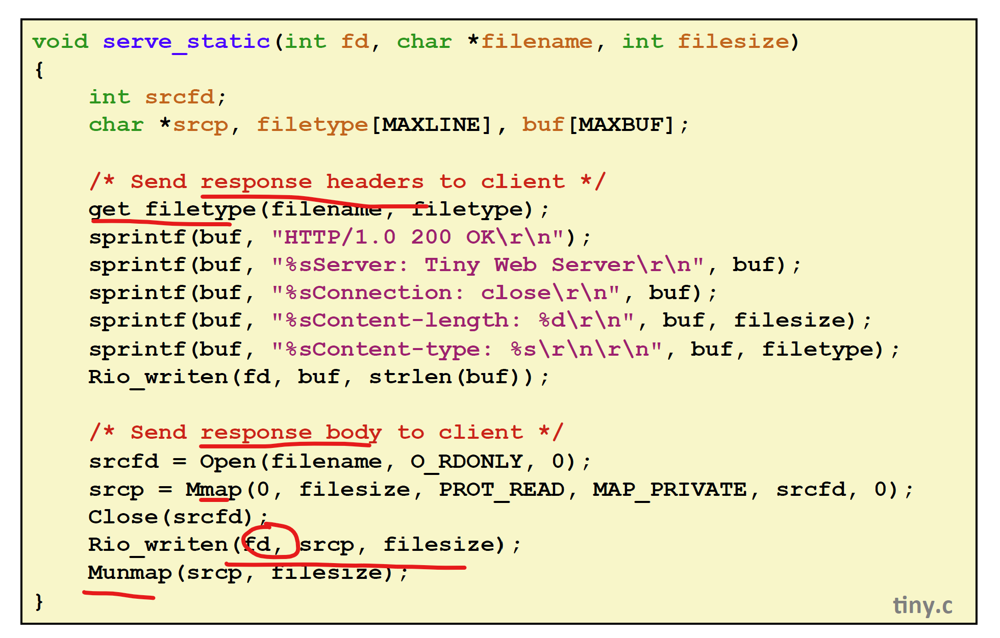

* 响应动态内容过程如下：

1. 如果客户端发送的URI包含了字符串"/cgi-bin"，则说明请求的是动态内容
2. 服务器f**ork()子进程**，并在子进程中处理URI。
3. 子进程运行代码并产生动态内容，服务器返回子进程产生的结构

#### CGI及动态内容产生过程举例

* CGI

CGI程序简单的定义了浏览器/服务器/子进程的数据传输标准，但CGI只是以前服务器产生动态内容的标准，现在被许多其他新的技术取代了。（fastCGI/Apache modules等等）

* 动态内容产生详解

1，浏览器怎么把参数传给服务器？

答：在URI后面添加参数，参数由‘？’开始，用‘&’分割。

2，服务器怎么把参数传给子进程呢？

答：首先URI后面接的参数放在了环境变量 QUERY_STRING中，提出出来即可。

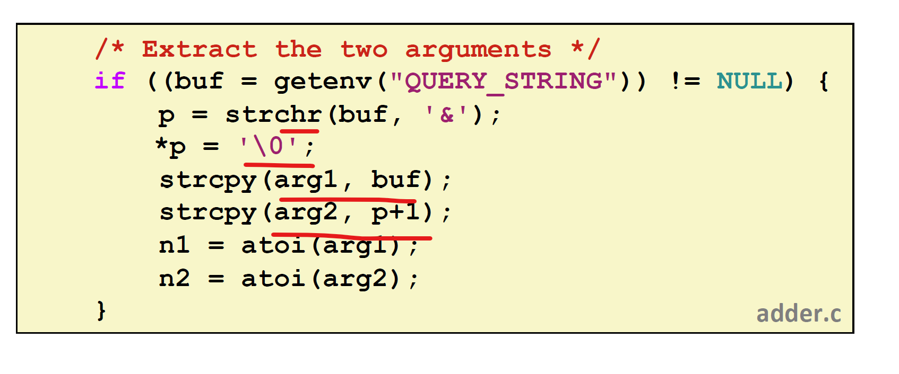

3，服务器怎么获得子程序产生的动态结果？

答：输出重定向，用dup2

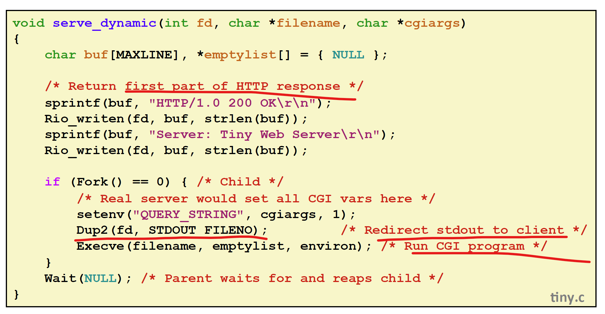

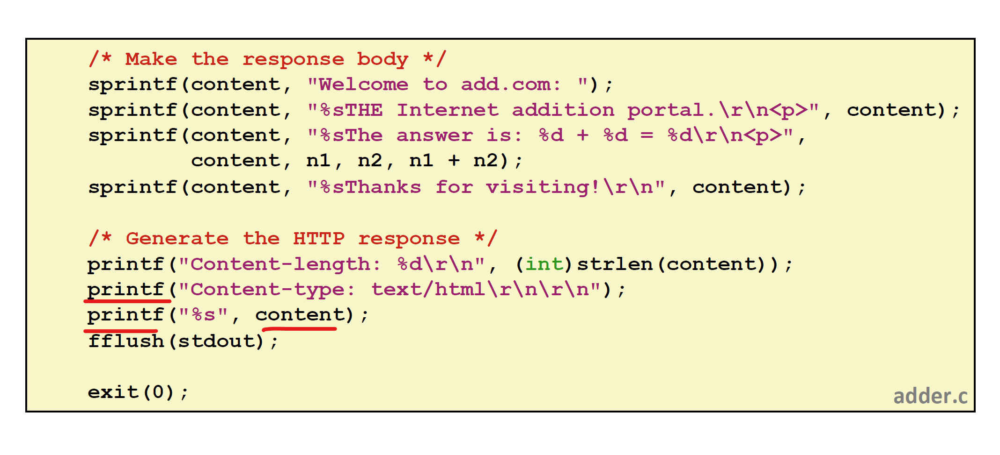

注意：sprintf把内容输入到content上，而不是输入到fd上（因为stdout重定向到了fd）

