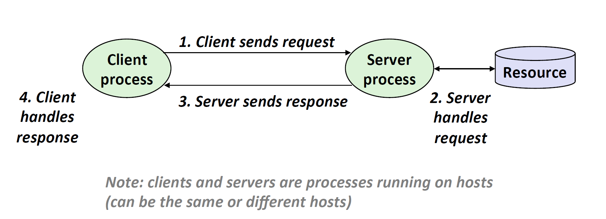
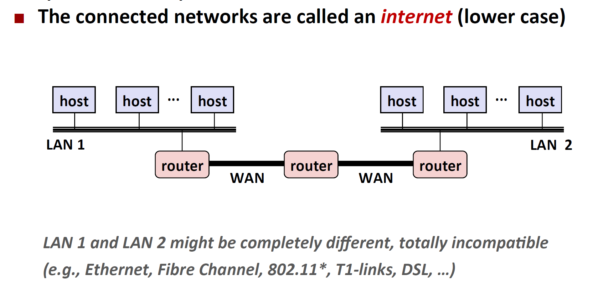

# 网络编程

### 前提

重点讲编程，网络的数据如何传输，路由器，集线器，以太网，局域网等等知识，看“计算机网络”即可。

一些图：

### 协议

由于存在着不同的LANs和不同的WANs，数据应该怎样在不同的设备上传输呢？

解决办法：每一台主机或者路由器上，都有一层协议软件，能够帮助不同主机和路由器之间进行数据传输（比如一致的命名方式，唯一标识主机），还能够消除不同网络的差异（不同网络可能采取不同的数据封装方式，协议提供统一的封装格式，帮助网络间的通信）总的来说，协议做了两件事：

1. 提供了命名机制
2. 提供了传输机制