# 高速缓存

性质：体积小速度快的SRAM组成，完全由硬件控制，集成在CPU芯片内，储存着经常被访问的来自主存（main memory）的块（blocks）。

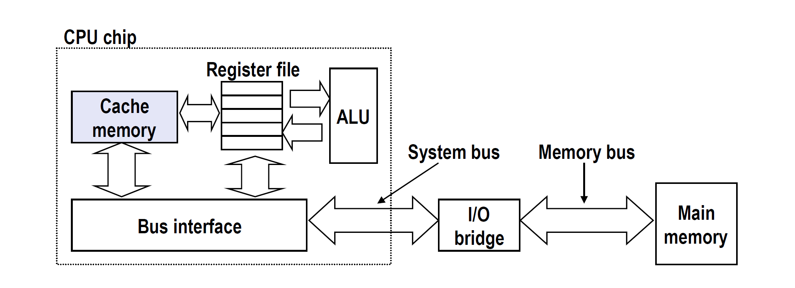

结构：S,E,B，其中s表示有多少个sets，e表示每个set有多少Line，b表示每个block中需偏移几个字节才能找到目标bytes。总容量是S * E * B

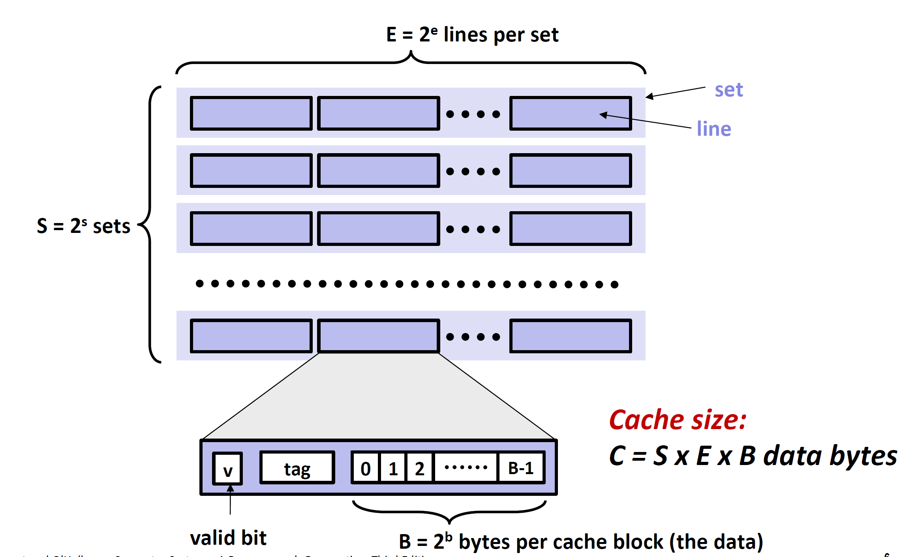

### 如何在缓存中读取目标字节：

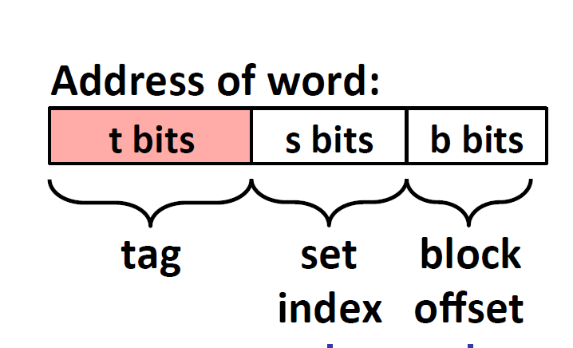

先确定在哪个set，然后根据tag确定在哪个Line，然后根据block offset确定字节位置。

### 直接映射缓存（E = 1)

定义：每个set只有一行，当tag和当前set中的block.tag不复合（或者valid位为0），miss，此set.block被替换。

模拟：通过以下模拟可以发现当只有一行时，有相同set index的block会经常发生替换。（注意此处主存大小M是16字节怎么计算而来）

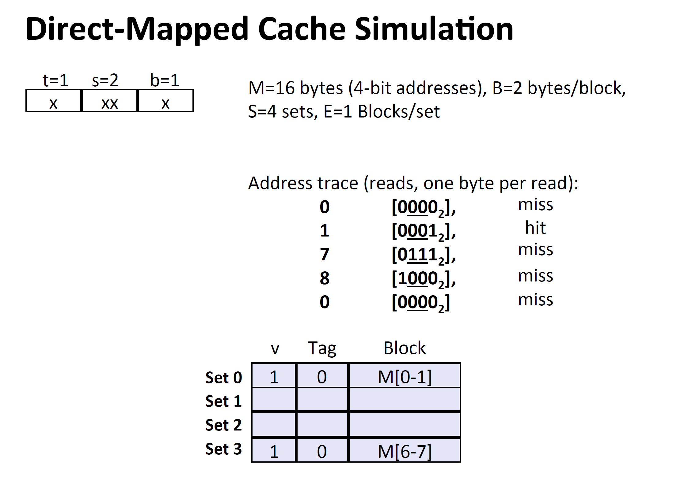

### E向关联缓存

定义：每一行set有多列（E>1),此时CPU会通过复杂的硬件，比较同一个set不同块的tag值，从而找到目标的block，目前能实现的最大E为16。

> block的大小是一个平衡值，太大则无法储存多个block，太小则可能会经常替换block。
>
> 如何知道一次是读4个字节还是两个字节呢？老师好像也不懂，应该由CPU根据类型是可以控制每次读的字节数字
>
> 最常见的替换策略是:LRU，最少被使用的块现被替换掉
>
> read操作发生Miss，每次都是在发生Miss的快被替换

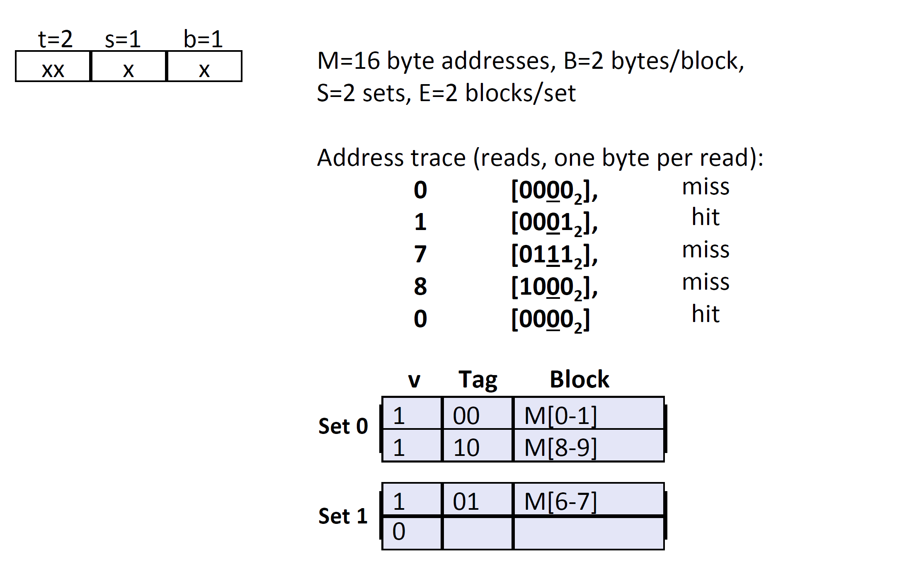

可以发现，同样的M,和缓存大小及地址值，但是t和s发生改变。

### 如何进行缓存写操作：

1,缓存命中所写block：两种策略

* 直接写入（write-through）：修改缓存block，并直接更新memory
* 回写（write back)：先修改缓存block，然后这个block被替换时，判断dirty bit（修改位），然后将修改后的block传给memory

2，缓存未命中所写block：两种策略

* 写-分配(write-allocate)：先把要修改的block加载到缓存在修改
* 写-不分配(No- write-allocate)：直接在memory中修改数据

一般使用的是：Write-back + Write-allocate

### 缓存层次结构

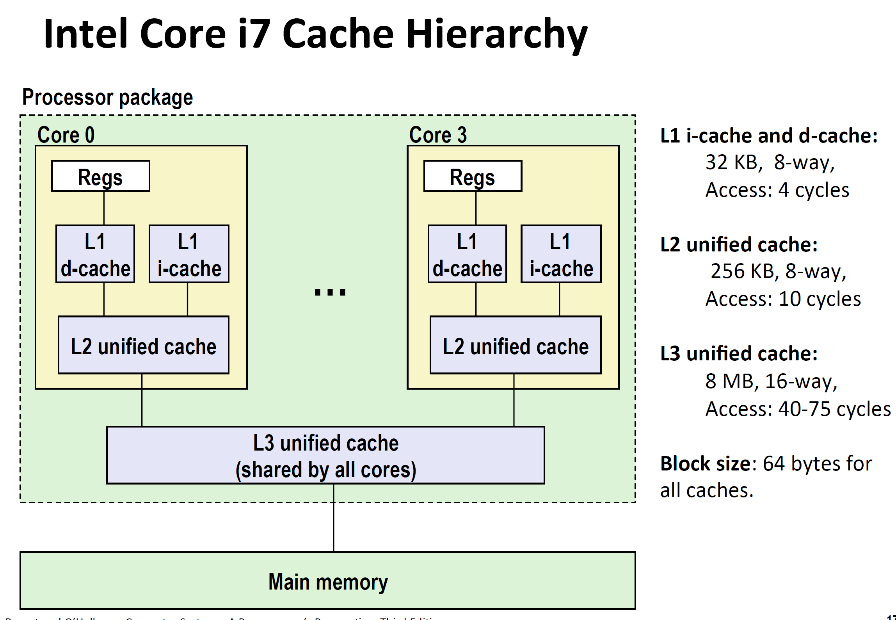

缓存性能测试：

* 未命中率：一般非常低，比如L1级为3-10%，L2级不到1%
* 命中时间：4-10 clock cycles
* 未命中损失：50-200
* 未命中损失很大，通常99%和97%命中率，性能差2倍

### 编写缓存友好的代码

* 让最常用的命令（内循环）能够快速访问
* 需要1，在内循环中，把经常用的数据定义成局部变量，因为局部变量一般放在寄存器中。2，每次循环跨距为1，也可以提高局部性，从而增加命中率。比如跨距为1比跨距为2的命中率大2倍。
* 通过对缓存的题解，可以量化我们的局部性。

### 存储器山

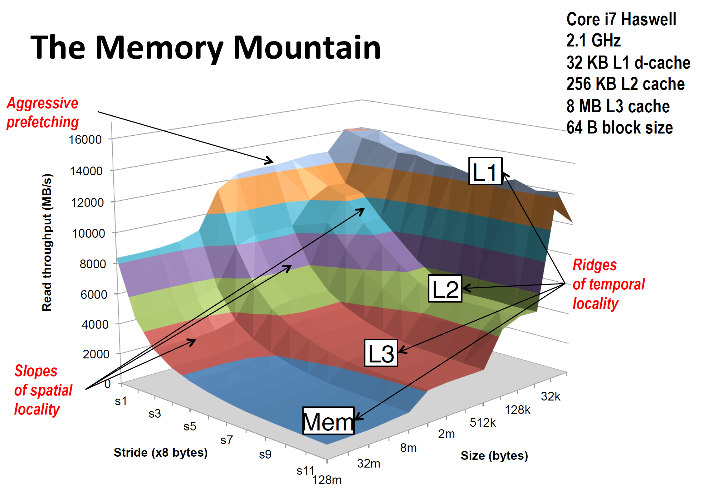

吞吐量（Read Throughput）：每秒钟能处理多少数据

Stride：步长，Size：数据量大小

可以发现当步长越小，数据量越小，吞吐量越大。

### 改变内层循环的空间局部性

背景：对N*N的矩阵做内积，一共需要N^3次操作，具体代码如下：

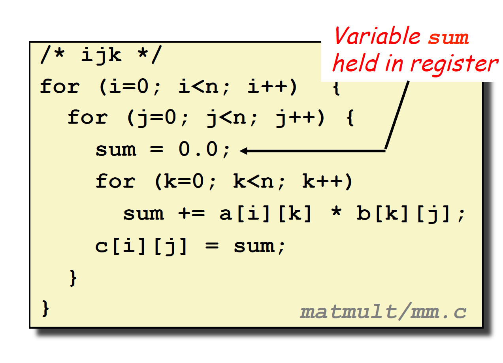

一共有三层循环（ijk)，最内层循环需要访问矩阵A和矩阵B，其访问方式如下所示：

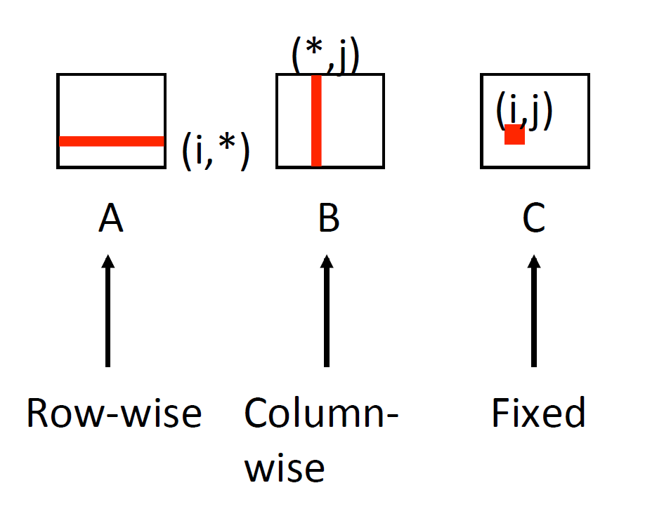

假设一个block只能存放四个double，则每一次循环，A的miss率为四分之一，而B的Miss率为百分之百，一共为1.25

当改变内层循环的数据访问方式，提高空间局部性，如下所示：

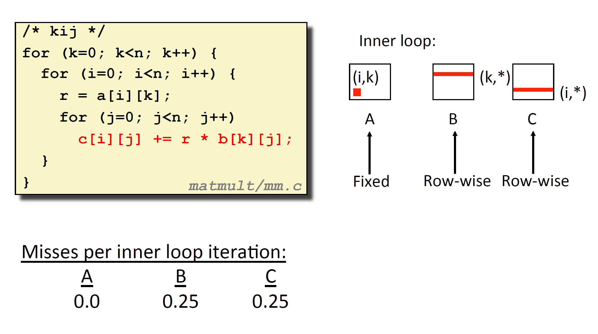

此时(kij)，miss rate降低，虽然此时在内层循环会增加write操作，（上面ijk的sum存在寄存器，不考虑write），但是通常来说，**write操作对性能的影响更小**，因为write操作是可以延后处理的。

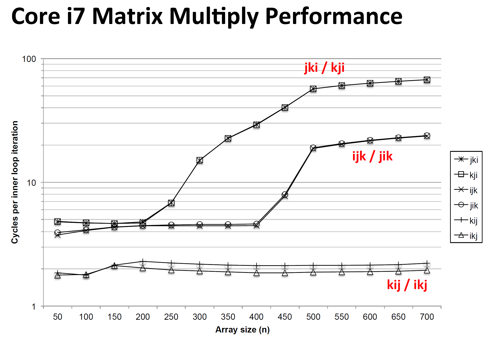

可以看到改变循环顺序，性能会发生很大的变化。

### 使用分块技术提高时间局部性

大致思路为，将程序中的数据结构组织成大的片（chunk），并能使一个片再加到L1，能够在这个片中进行所有的读写，完成后扔掉这个片。

分块会使程序变得难以理解。